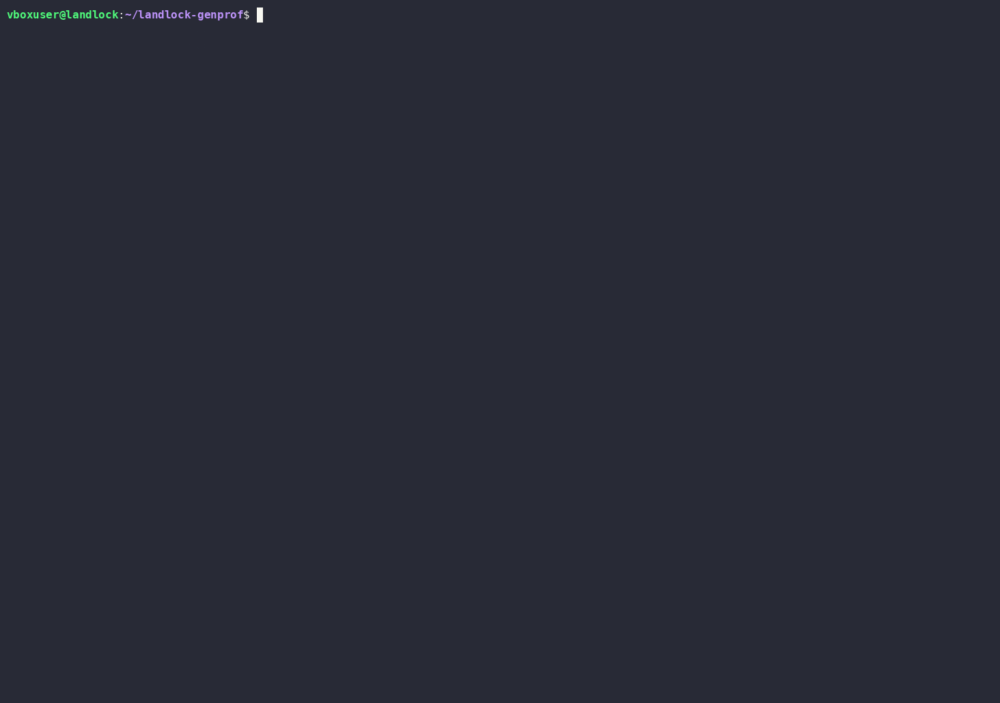

<link rel="stylesheet" href="css/landing.css">
<section class="lg-hero">
  

    
Kubernetes security profile generator

    <h1 class="lg-headline">Observe the pod. Draw the <em>tightest</em> boundary that fits.</h1>
    
Landlock, seccomp, <code class="lg-inline-code">NetworkPolicy</code>, and Linux capabilities policies are normally guessed by hand, before anyone has watched the app run. <strong>landlock-genprof</strong> watches first — a training run, then a profile sized to exactly what it saw.

    
Status: the observe → synthesize → export pipeline is built and confirmed end to end on a live cluster, tagged <code class="lg-inline-code">v0.1.2</code><!-- x-release-please-version -->. <a href="docs/roadmap.html">Roadmap</a> tracks what's actually built, milestone by milestone.

    

      <a class="lg-btn lg-primary" href="#lg-loop">Try it in 3 commands</a>
      <a class="lg-btn lg-ghost" href="#lg-start">Where do I start?</a>
    

    

      
PLAT · nginx-demo / defaultobserved 60s

      <svg viewBox="0 0 760 300" role="img" aria-labelledby="lgSurveyTitle">
        <title id="lgSurveyTitle">A loose, hand-guessed permission boundary compared against a tight boundary drawn around the paths, ports, and syscalls actually observed during a training run.</title>
        <polygon points="60,40 700,30 730,150 660,270 120,260 40,150" fill="none" stroke="var(--lg-line)" stroke-width="1.6" stroke-dasharray="7 6" />
        <text x="60" y="24" font-family="var(--lg-font-mono)" font-size="12" fill="var(--lg-ink-soft)" letter-spacing="0.04em">HAND-GUESSED — everything, just in case</text>
        <polygon points="330,110 420,95 470,130 480,175 440,205 360,210 305,175 300,135" fill="var(--lg-accent)" fill-opacity="0.09" stroke="var(--lg-accent)" stroke-width="2.4" />
        <text x="305" y="230" font-family="var(--lg-font-mono)" font-size="12" fill="var(--lg-accent)" letter-spacing="0.04em">OBSERVED &amp; GENERATED</text>
        <g fill="var(--lg-ink-soft)">
          <circle cx="345" cy="130" r="3" /><circle cx="392" cy="118" r="3" /><circle cx="430" cy="140" r="3" />
          <circle cx="455" cy="165" r="3" /><circle cx="420" cy="185" r="3" /><circle cx="375" cy="190" r="3" />
          <circle cx="335" cy="170" r="3" /><circle cx="322" cy="145" r="3" /><circle cx="400" cy="155" r="3" />
        </g>
      </svg>
      

         broad, hand-authored — never trimmed back
         generated from what actually ran, confidence-annotated
      

    

  

</section>
<section class="lg-section" id="lg-loop">
  

    
<h2>Observe, review, apply</h2>the whole loop

    
Three commands, in this order, every time. Nothing is ever applied to the cluster without the middle one.

    

      

        01 — trace
        <h3>Watch it run</h3>
        
Trains on the target pod for a set duration, capturing filesystem, network, syscall, and capability activity via eBPF.

        <pre><code>kubectl landlock-genprof trace \
  --pod nginx-demo -n default \
  --binary /usr/sbin/nginx \
  --duration 60s</code></pre>
      

      

        02 — review
        <h3>See what it saw</h3>
        
Prints exactly what was observed, what's confident vs. not, and which artifacts are ready to apply.

        <pre><code>kubectl landlock-genprof review \
  nginx-demo</code></pre>
      

      

        03 — apply-proposal
        <h3>You decide, not the tool</h3>
        
Prompts for confirmation before touching the cluster. Nothing here is ever automatic.

        <pre><code>kubectl landlock-genprof \
  apply-proposal nginx-demo</code></pre>
      

    

  

</section>
<section class="lg-section" id="lg-demo">
  

    
<h2>See it run</h2>real recording, not staged

    
The exact loop above, captured against a live cluster — trace with real traffic, the generated profile, the review summary, the raw <code class="lg-inline-code">SecurityProfileProposal</code> object, and <code class="lg-inline-code">apply-proposal --restart</code>. <a href="https://asciinema.org/a/XGK9ymbeeZ4UeQib">Play it interactively on asciinema →</a>

    

      
RECORDING · nginx-demo / defaulttrace → review → apply-proposal

      
    

  

</section>
<section class="lg-section">
  

    
<h2>One training run, four domains</h2>what gets generated

    
Every rule carries a confidence level — high, medium, or low — so review has something concrete to look at, not a wall of unlabeled YAML.

    

      

        Filesystem<h3>Landlock policy</h3>
        → PodLock LandlockProfile
        seen on every run
      

      

        Network<h3>Egress rights</h3>
        → Kubernetes NetworkPolicy
        seen on every run
      

      

        Syscalls<h3>Seccomp profile</h3>
        → security-profiles-operator CR
        needs --history
      

      

        Capabilities<h3>Linux capabilities</h3>
        → securityContext fragment
        review before prod
      

    

  

</section>
<section class="lg-section" id="lg-start">
  

    
<h2>Where to start</h2>pick one

    

      <a class="lg-path-card lg-ticked" href="docs/test-environment.html">
        No cluster yet<h3>Set up a test environment</h3>
        
A disposable kind cluster, from nothing — one script.

        docs/test-environment →
      </a>
      <a class="lg-path-card lg-ticked" href="INSTALL.html">
        Already have one<h3>Install</h3>
        
Get the CLI, apply the RBAC/CRDs, against a cluster you already run.

        INSTALL →
      </a>
      <a class="lg-path-card lg-ticked" href="docs/usage.html">
        Reference<h3>Usage &amp; CLI reference</h3>
        
Every flag, one section each — plus a generated page per command.

        docs/usage →
      </a>
      <a class="lg-path-card lg-ticked" href="docs/architecture.html">
        Under the hood<h3>Architecture</h3>
        
Components and interactions, at a glance — deep dives nested underneath.

        docs/architecture →
      </a>
    

    

      <strong>Working on the codebase itself?</strong>
      See the <a href="HOW_TO_START.html">contributor quickstart</a> instead — git workflow, code walkthrough, first tasks per role.
    

  

</section>
<section class="lg-section">
  

    
<h2>Complementary, not competing</h2>positioning

    
landlock-genprof doesn't enforce anything itself — it feeds three existing, independent enforcement mechanisms, one per domain, in the format each already expects. Full positioning against PodLock/SPO/static compliance scanners: <a href="docs/product-definition-v1.html">product definition</a>.

    

      

        Filesystem (Landlock)<h3>PodLock</h3>
        Kubewarden ecosystem — enforces at container startup
      

      

        Syscalls (seccomp)<h3>security-profiles-operator</h3>
        materializes the profile onto every node
      

      

        Network<h3>Your CNI</h3>
        any implementation of NetworkPolicy
      

    

  

</section>

