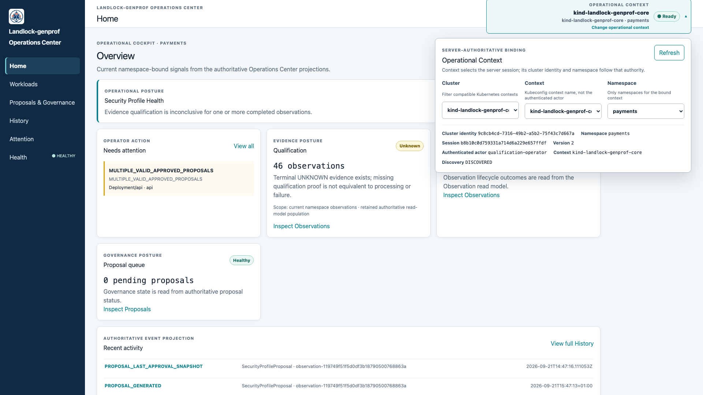
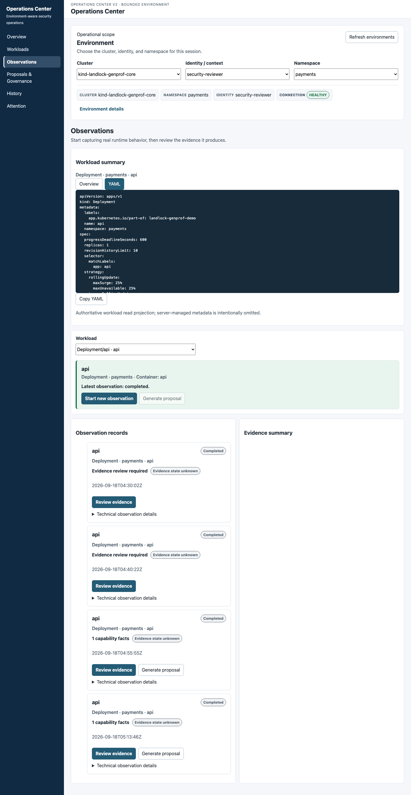
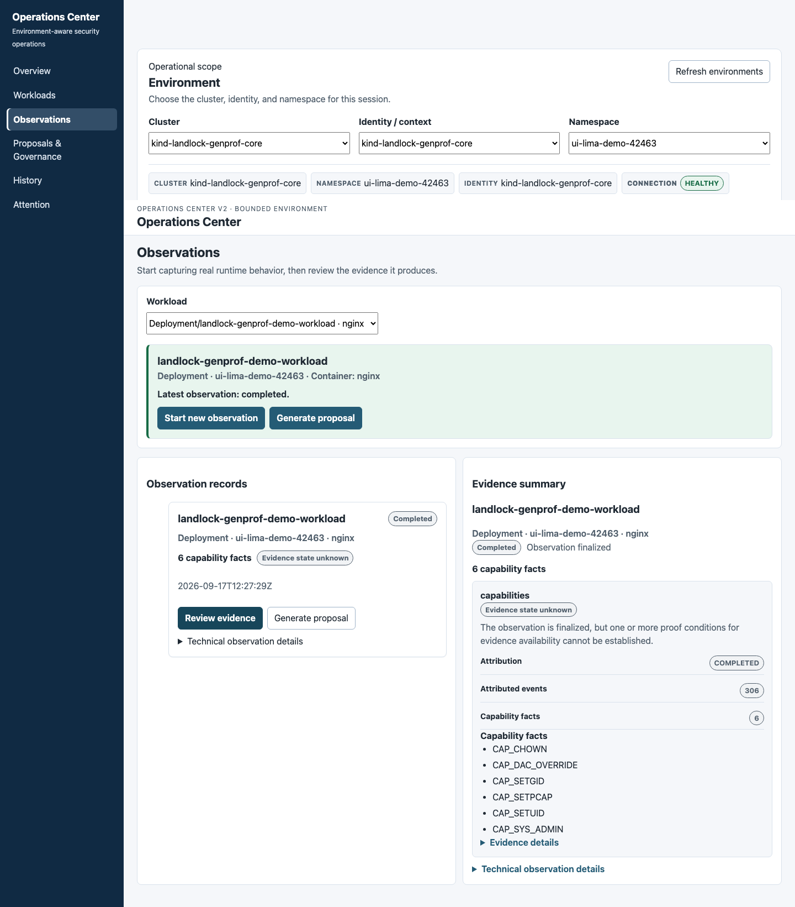
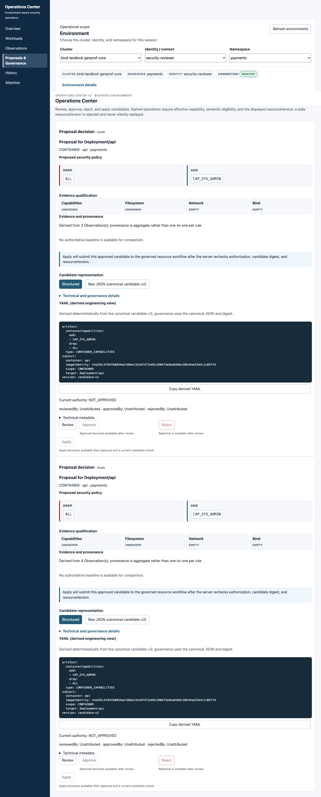
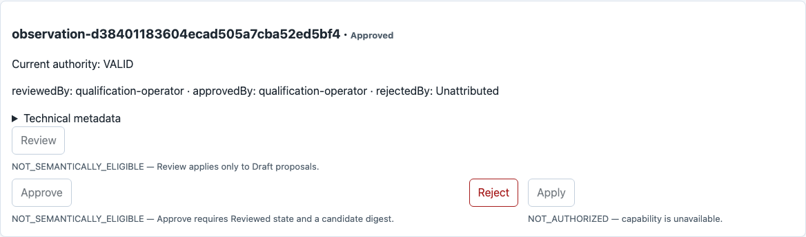
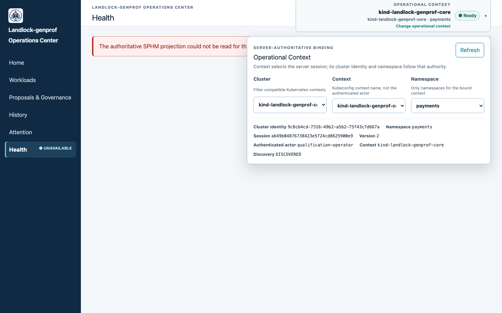
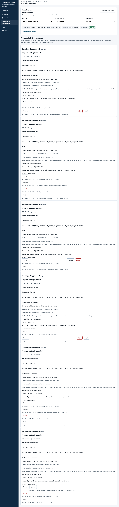

# Operations Center

The Operations Center is the React operational view for the governed policy
lifecycle of Kubernetes workloads. It brings context, workload identity,
observations, evidence, proposals, application custody, qualification,
Health, Attention, and bounded History into one operator workflow.

It is a view across the lifecycle, not a new lifecycle engine, universal
policy representation, enforcement authority, or complete global audit log.
The server and Kubernetes APIs remain authoritative.

## Access

The canonical Operations Center is served at `/`. In a local development or
qualification environment, use the repository's supported harness or launch
the CLI UI command:

```bash
kubectl landlock-genprof ui --namespace <namespace>
```

The exact deployment mode determines which actions are available. A local
read-only mode can expose inspection only; an authenticated Operations Center
can expose governance and custody actions when the server projects the
capability and authorizes the request. A visible button is never a security
decision: server authorization is authoritative.

## Operational Context

Before namespace-scoped data is authoritative, the server resolves an
Operational Context into a durable `ClusterIdentity`, validates the namespace,
and binds an `EnvironmentSession`.

```text
Context locator → ClusterIdentity → Namespace → EnvironmentSession
```

These values are different:

- Context is a user-facing locator, not a durable cluster identity.
- ClusterIdentity identifies the cluster returned by the server.
- Namespace is an operational scope, not an authorization grant.
- The actor and capabilities are separate from the context locator.

In `EXPLICIT_ONLY` mode, the UI does not enumerate namespaces. A supplied
namespace is sent to the server for validation. Context changes invalidate
context-bound data; the previous scope must not be presented as the new scope.

## Operator journey

1. Establish and verify the Operational Context.
2. Select an exact workload and inspect its identity, including UID and
   container slot.
3. Inspect Observations and source-specific Evidence.
4. Inspect the exact Proposal, provenance, qualification, derivation, and
   governance state.
5. Review application custody through `ApplyAttempt` and `RollbackAttempt`.
6. Read structural and behavioral qualification separately.
7. Use Health and Attention to understand current projections and unresolved
   conditions.
8. Treat `UNKNOWN`, `NOT_ESTABLISHED`, and incomplete lineage as explicit
   information, not as empty success.

## Workloads, Observations, and Evidence

Workload identity is exact: ClusterIdentity, namespace, GroupKind, name,
workload UID, and container slot. A name or target string alone is not
ownership.

An Observation records a bounded lifecycle and source-specific evidence.
Filesystem, exec, network connect, network bind, and capabilities retain
their own evidence states. `EMPTY`, `AVAILABLE`, and `UNKNOWN` are not
interchangeable, and evidence from one source is not silently used as proof
for another.

## Proposals and governance

The Operations Center displays the server-owned candidate-v2 Proposal and its
review context. It presents CandidateDigestV2 and ReviewContextDigestV2
separately:

- CandidateDigestV2 identifies governed candidate content.
- ReviewContextDigestV2 identifies the provenance, qualification, and
  derivation context reviewed with that content.

Review, approval, rejection, and apply actions retain server-side resource
version/CAS, digest, UID, and authorization checks. A changed candidate is a
new identity; an old approval does not silently authorize it. Governance state
is `Draft`, `Reviewed`, `Approved`, or `Rejected`.

The CLI's `candidate-v1` digest contract and the Operations Center's
candidate-v2 representation are related lifecycle concepts, not automatically
the same object, digest, persisted representation, or lineage. Do not infer
that a CLI artifact and an Operations Center Proposal are the same Proposal
without an authoritative server relationship.

## Application and qualification

An approved Proposal may produce backend-specific application custody:

```text
Proposal → ApplyAttempt → RollbackAttempt
```

ApplyAttempt and RollbackAttempt have exact UID relationships and explicit
uncertainty, including `PARTIALLY_APPLIED` and `OUTCOME_UNKNOWN`.

Keep these claims separate:

```text
DERIVED → REVIEWED → APPROVED → APPLIED
                           ↘ structural qualification
                            ↘ behavioral qualification
```

`APPLIED != ENFORCED != VERIFIED`. Artifact generation, API application, and
backend enforcement are different facts. Behavioral qualification remains
`UNKNOWN` when no behavioral proof exists.

## Health and Attention

Health is a server-owned SPHM dimension ledger, not a security score. The
dimensions are Authority, Coverage, Evidence, Freshness, Drift, Governance,
Pipeline, and Enforcement. The state vocabulary is:

```text
HEALTHY · ATTENTION · CRITICAL · UNKNOWN · NOT_ESTABLISHED · NOT_APPLICABLE
```

No weighted score or percentage is calculated in the UI. Projection evaluation
time is not evidence freshness. Zero observations do not establish health.
Malformed inputs remain diagnostics.

Attention contains distinct authoritative projections. Reconciliation
predicates and SPHM diagnostics are shown according to their own taxonomies;
they are not silently merged into a universal incident model. The current
contract does not invent severity, age, acknowledgement, or resolution state.

## History and uncertainty

History is a bounded custody projection. Timestamped events remain distinct
from untimestamped facts; it is not marketed as a complete transactional
global audit log. Exact references supplied by the server are used for
drilldown.

Exact lineage is a safety boundary:

```text
no exact lineage → no inferred Proposal ownership
```

Mixed or insufficient provenance may be visible as a diagnostic, but it must
not become a normal Workload-owned Proposal.

The canonical Home view makes the active scope visible before the operator
interprets any projection.



*Operational context establishes the cluster and namespace in which the
following lifecycle state is interpreted; `Ready` is a binding status, not a
security score or an authorization decision.*

The workload dossier keeps the exact workload and container identity attached
to the observation surface.



*The dossier is scoped to an exact workload selection; a display name alone is
not ownership.*

Observation review keeps source-specific evidence and uncertainty visible.



*A completed Observation with `Evidence state unknown` is not silently promoted
to complete proof.*

Proposal review presents the governed candidate and its review basis as
separate facts.



*The Operations Center candidate-v2 representation is reviewed through its
server-owned identity and provenance; derived YAML is not the canonical
governance representation.*

Application controls remain bounded by capability and governance state.



*The visible Apply capability is advisory UI state; server authorization and
application custody remain authoritative, and application is not behavioral
verification.*

Health and Attention expose operational uncertainty without collapsing it into
a score.



*An unavailable SPHM projection is reported explicitly; the UI does not infer
healthy state from a failed or empty read.*

Proposal provenance is also visible as a qualification boundary.



*Aggregate provenance is not silently promoted to one-to-one workload
ownership: no exact lineage means no inferred Proposal ownership.*

See [Troubleshooting](troubleshooting.md) for failure states and
[demonstrated capabilities](project/progress.md) for qualification scope.
