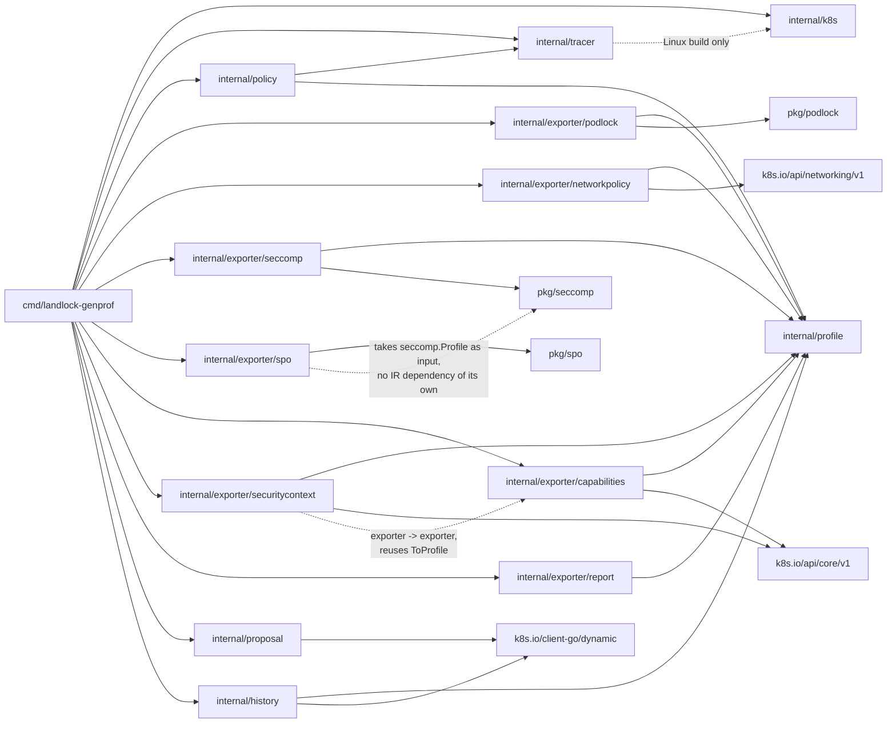

# Architecture

This document describes the pipeline architecture (milestones M1-M4, see
[`roadmap.md`](roadmap.md)) — see each diagram's legend for what's actually
wired up vs still planned.

---

## 1. Data flow — components and trust boundary

**Legend:** ✅ implemented · 🚧 types/signatures defined, logic = stub
(`panic("not implemented")`). Dotted arrows are indirect/out-of-process
relationships (network calls, reused-but-not-piped data, external
controllers reconciling); solid arrows are direct data flow within the
CLI process. `{pod}`/`{identity}` mean the same thing as `<pod>`/
`<identity>` used in prose elsewhere in this repo — mermaid's parser
doesn't accept angle brackets inside node/participant labels (confirmed:
they broke rendering on GitHub), so both diagrams in this doc use braces
instead.

Note on `trace_tcpconnect`/`trace_bind`: their field names in
`internal/tracer/trace_linux.go` (`dst.port`, `addr.port` — both nested,
neither the flat name first guessed) are now confirmed against a live
cluster, the same way `trace_open`/`trace_exec`'s were (see
`docs/roadmap.md` M1). A wrong field name now fails with a clear error
(`requireField`) instead of a nil-pointer panic.

**Trust boundary worth noting** (details in
[`threat-model.md`](threat-model.md)): the tracer needs elevated
capabilities (`CAP_BPF`, `CAP_SYS_ADMIN` depending on the kernel) to attach
eBPF gadgets — it's the only piece of the pipeline that touches the host
kernel and the observed pod directly. Everything else (synthesis, YAML
generation) runs with the CLI process's normal privileges.

---

## 2. Sequence of a full training run

```mermaid
sequenceDiagram
    actor Dev
    participant CLI as cmd/landlock-genprof
    participant K8s as internal/k8s
    participant Tracer as internal/tracer
    participant IG as Inspektor Gadget (eBPF)
    participant Policy as internal/policy
    participant Exp as internal/exporter/podlock
    participant FS as profile.yaml
    participant NetExp as internal/exporter/networkpolicy
    participant NetFS as networkpolicy.yaml
    participant SecExp as internal/exporter/seccomp
    participant SecFS as seccomp.json
    participant SecCRExp as internal/exporter/spo
    participant SecCRFS as {pod}-seccompprofile.yaml
    participant CapExp as internal/exporter/capabilities
    participant CapFS as capabilities.yaml
    participant SCExp as internal/exporter/securitycontext
    participant SCFS as securitycontext.yaml
    participant RepExp as internal/exporter/report
    participant RepFS as report.md
    participant Prop as internal/proposal
    participant K8sAPI as SecurityProfileProposal (cluster object)
    participant PatchFS as {identity}-patched.yaml

    Dev->>CLI: trace --pod nginx-demo --duration 60s --network-out networkpolicy.yaml --seccomp-out seccomp.json --seccomp-profile-out seccompprofile.yaml --capabilities-out capabilities.yaml --security-context-out securitycontext.yaml --report-out report.md
    CLI->>K8s: Resolve(namespace, pod, container)
    K8s-->>CLI: TargetPod{..., Labels}
    CLI->>Tracer: Trace(Options{PodName, Duration, ...})
    par concurrently
        Tracer->>IG: kubectl gadget run trace_open:latest -n ... -c ...
        loop for Duration
            IG-->>Tracer: Event{Syscall: "openat", Path, Mode: read/write/read_write}
        end
    and
        Tracer->>IG: kubectl gadget run trace_exec:latest --paths -n ... -c ...
        loop for Duration
            IG-->>Tracer: Event{Syscall: "execve", Path, Mode: "exec"}
        end
    and
        Tracer->>IG: kubectl gadget run trace_tcpconnect:latest -n ... -c ...
        loop for Duration
            IG-->>Tracer: Event{Syscall: "connect", Port, Mode: "egress"}
        end
    and
        Tracer->>IG: kubectl gadget run trace_bind:latest -n ... -c ...
        loop for Duration
            IG-->>Tracer: Event{Syscall: "bind", Port, Mode: "ingress"}
        end
    and
        Tracer->>IG: kubectl gadget run advise_seccomp:latest -n ... -c ...
        Note over IG: flush-on-stop: emits once,<br/>at the end of Duration
        IG-->>Tracer: advise.text = "// container\n{seccomp JSON}"
    and
        Tracer->>IG: kubectl gadget run trace_capabilities:latest -n ... -c ...
        loop for Duration
            IG-->>Tracer: Event{Syscall: "CAP_NET_BIND_SERVICE", Mode: "capability"}
        end
    end
    Tracer-->>CLI: []Event (merged), []string (architectures)
    CLI->>Policy: Synthesize([]Event, []string)
    Note over Policy: filesystem: aggregation by directory<br/>network: aggregation by (port, direction)<br/>syscalls: aggregation by name<br/>capabilities: aggregation by name<br/>+ Confidence calculation for all but syscalls (always low without --history)
    Policy-->>CLI: BehaviorProfile{Filesystem, Network, Syscalls, Capabilities}
    CLI->>Exp: ToProfile(meta, BehaviorProfile.Filesystem)
    Note over Exp: IR permission set -><br/>PodLock's 4 joint categories
    Exp-->>CLI: *podlock.LandlockProfile
    CLI->>Exp: ToYAML(LandlockProfile)
    Exp-->>CLI: []byte
    CLI->>FS: writes LandlockProfile (YAML, PodLock format)
    opt --network-out set and Network.Accesses non-empty
        CLI->>NetExp: ToPolicy(meta, BehaviorProfile.Network)
        Note over NetExp: one port per Ingress/Egress rule,<br/>podSelector from the traced pod's own labels
        NetExp-->>CLI: *networkingv1.NetworkPolicy
        CLI->>NetExp: ToYAML(NetworkPolicy)
        NetExp-->>CLI: []byte
        CLI->>NetFS: writes NetworkPolicy (YAML)
    end
    opt --seccomp-out set and Syscalls.Accesses non-empty
        CLI->>SecExp: ToProfile(BehaviorProfile.Syscalls)
        Note over SecExp: single SCMP_ACT_ALLOW rule,<br/>sorted syscall names
        SecExp-->>CLI: *seccomp.Profile
        CLI->>SecExp: ToJSON(Profile)
        SecExp-->>CLI: []byte
        CLI->>SecFS: writes seccomp profile (plain JSON, no comments)
        CLI->>Dev: prints not-yet-confirmed syscalls to stdout
    end
    Note over CLI: seccompLocalhostProfile = spo.LocalhostProfilePath(name, namespace),<br/>computed unconditionally whenever Syscalls.Accesses is non-empty —<br/>independent of --seccomp-out/--seccomp-profile-out, used below and in Prop
    opt --seccomp-profile-out set and Syscalls.Accesses non-empty
        CLI->>SecCRExp: ToSeccompProfile(meta, seccomp.Profile)
        Note over SecCRExp: reuses SecExp.ToProfile() output directly —<br/>field-for-field identical to SPO's own schema
        SecCRExp-->>CLI: *spo.SeccompProfile
        CLI->>SecCRExp: ToYAML(SeccompProfile)
        SecCRExp-->>CLI: []byte
        CLI->>SecCRFS: writes SeccompProfile custom resource (YAML)
    end
    opt --capabilities-out set and Capabilities.Accesses non-empty
        CLI->>CapExp: ToProfile(BehaviorProfile.Capabilities)
        Note over CapExp: drop: [ALL] always,<br/>add: sorted, CAP_ prefix stripped
        CapExp-->>CLI: *corev1.Capabilities
        CLI->>CapExp: ToYAML(Capabilities)
        CapExp-->>CLI: []byte
        CLI->>CapFS: writes capabilities fragment (YAML, confidence comments)
    end
    opt --security-context-out set and (Capabilities.Accesses non-empty or seccompLocalhostProfile set)
        CLI->>SCExp: ToSecurityContext(BehaviorProfile.Capabilities, seccompLocalhostProfile)
        Note over SCExp: reuses CapExp.ToProfile() internally —<br/>the one exporter-to-exporter dependency in this codebase
        SCExp-->>CLI: *corev1.SecurityContext
        CLI->>SCExp: ToYAML(SecurityContext)
        SCExp-->>CLI: []byte
        CLI->>SCFS: writes composed securityContext fragment (YAML, confidence comments)
    end
    opt --patched-manifest-out set and (Capabilities.Accesses non-empty or seccompLocalhostProfile set)
        CLI->>K8s: PatchedManifest(ctx, client, resolvedTarget, SecurityContext)
        Note over K8s: fetches the live owner (Deployment/StatefulSet/DaemonSet)<br/>or bare pod, merges sc into the target container only —<br/>every other existing securityContext field untouched
        K8s-->>CLI: identity, []byte
        CLI->>PatchFS: writes clean, ready-to-apply manifest (owner's, not the ephemeral pod's, when owned)
    end
    opt --report-out set
        Note over CLI: never skipped, even if every domain is empty —<br/>an empty domain is itself useful review content
        CLI->>RepExp: ToMarkdown(meta, BehaviorProfile, GeneratedFiles{...})
        Note over RepExp: one Markdown doc, all four domains,<br/>links to whichever sibling files were also written this run
        RepExp-->>CLI: []byte
        CLI->>RepFS: writes review report (Markdown)
    end
    Note over CLI: mandatory, not opt-in — re-renders each artifact (ToYAML/ToJSON) from BehaviorProfile independently,<br/>same conditions as the write* functions above — redundant, not a refactor
    CLI->>Prop: Save(ctx, client, namespace, target.PodName, Spec{PodLock: string(yamlBytes), ...})
    Note over Prop: create-or-update (overwrite on re-run, not accumulated) —<br/>via runtime.DefaultUnstructuredConverter, not a hand-rolled map
    Prop->>K8sAPI: Create or Update
    Note over CLI: run fails outright if this fails (missing CRD/RBAC) — no silent degrade to local files only
    Dev->>FS: human review — checks `low`/`medium` rules
    Dev->>NetFS: human review — checks generated ports/podSelector
    Dev->>SecFS: human review — checks syscalls flagged on stdout
    Dev->>SecCRFS: human review, then kubectl apply — requires security-profiles-operator installed to take effect
    Dev->>CapFS: human review — pastes add/drop under a container's own securityContext
    Dev->>SCFS: human review — pastes the composed fragment under a container's own securityContext
    Dev->>RepFS: human review — one combined pass across all four domains
    Dev->>K8sAPI: human review via kubectl/GitOps — first slice of an evidence/proposal/approved-policy model, no operator reads this yet
    Dev->>PatchFS: human review, then kubectl apply directly — a rollout for an owned pod, delete+recreate for a bare one
    Dev->>Dev: kubectl apply / node deployment / manual securityContext edit (out of CLI scope)
```

The CLI **stops at writing the YAML** — it never calls `kubectl apply`
itself (see README §5, "mandatory human review").

**`internal/exporter/securitycontext` composes rather than merges.**
The seccomp and capabilities exporters were deliberately *not* folded
into one backend: `corev1.SeccompProfile.LocalhostProfile` only ever
takes a path reference, never inline content ("Must be a descending
path, relative to the kubelet's configured seccomp profile location",
per its own doc comment in `k8s.io/api/core/v1`), so a true merge would
still produce two files — the seccomp JSON plus a wrapper referencing
it — just with more indirection. Instead, `securitycontext` is a third,
additive view: it reuses `internal/exporter/capabilities.ToProfile`
directly (this codebase's first exporter-to-exporter dependency — every
exporter before it only ever depended on `internal/profile`) and takes a
plain filename for the seccomp reference, computed by the CLI from
whatever `--seccomp-out` actually wrote this run — never a dangling
reference to a file that doesn't exist. `internal/exporter/seccomp` and
`internal/exporter/capabilities` are unchanged and still independently
usable on their own.

**`internal/k8s.PatchedManifest` goes one step further than the bare
`securityContext` fragment: a complete, ready-to-apply manifest.**
Deliberately lives in `internal/k8s`, not a new exporter — it isn't an
IR conversion, it fetches live cluster state (the target's owner, or
the bare pod itself) and patches it, reusing `DetectOwner`/`OwnerKind`
from `internal/k8s/restart.go` directly rather than reinventing the same
distinction. The key nuance: most container-spec fields, including
`securityContext`, are immutable on an already-running Pod, so for an
owned pod the artifact that's actually useful is the *owner's* manifest
(`kubectl apply` on it triggers a rollout, the real supported way to
change this) — not the ephemeral pod's own YAML. Merges, never replaces:
only `Capabilities`/`SeccompProfile` are ever set on the target
container, every other existing `securityContext` field is preserved —
a real bug this caught during its own test-writing: naively re-marshaling
the live-fetched object still produced `status: {}` in the output (no
`omitempty` on that field in the real API types), fixed with a dedicated
minimal manifest type (`cleanManifest`) that omits the field entirely
rather than trying to zero-value it away.

**`internal/exporter/report` is the fifth output, but the simplest
exporter in the codebase — just `internal/profile` in, Markdown out.**
Unlike `securitycontext`, it doesn't reuse any sibling exporter's
conversion logic: it presents the IR's own data directly (paths, ports,
syscalls, capabilities, each with their `Confidence`) rather than
converting it into another schema, so there's nothing to share. It's
also the one output never gated on anything being non-empty — an empty
`Capabilities`/`Syscalls` domain is itself informative review content
(most often the startup blind spot, `docs/e2e-demo.md` Findings 2/5, not
a real absence of activity), so `--report-out` always writes when
passed, standalone and independent of every other `--*-out` flag: it
shows the real IR data directly, and only *additionally* links to
sibling files that happen to have been generated the same run.

**`internal/proposal` is the first slice of a larger evidence/proposal/
approved-policy model, not a sixth exporter.** It doesn't convert the IR
into a new format the way the exporters do — it stores the exact
rendered text (YAML/JSON) the exporters' own `ToYAML`/`ToJSON` already
produce for the local files, as one `SecurityProfileProposal` cluster
object, reviewable via `kubectl`/GitOps instead of only local files.
Deliberately *not* a structured sub-spec (`podlock.LandlockProfileSpec`
etc., the first version this shipped as): live testing showed that
without `apiVersion`/`kind`/`metadata`, none of those were directly
copy-pasteable or `kubectl apply -f`-able, defeating the point of a
*reviewable* artifact — a plain string holding the real rendered content
is what a human actually wants to copy out of `kubectl get
securityprofileproposal -o yaml`.
`TrainingHistory` (`internal/history`) is this model's evidence stage —
already built, no controller, since accumulating observations is simple
CRUD, not reconciliation. `SecurityProfileProposal` is the proposal
stage, same reasoning: publishing a snapshot needs no controller either
(`internal/proposal/store.go`'s `Save` is a plain create-or-update,
overwriting on every re-run — a proposal represents the *latest*
recommendation, not an accumulation, unlike `TrainingHistory.Merge`). An
eventual approved-policy stage (`WorkloadSecurityProfile`) plus an
operator to enforce it are deliberately **not** part of this — that's
the one stage that genuinely needs a reconciliation loop (keeping
applied resources from drifting), unlike the two evidence/proposal
stages before it.

**`internal/policy` produces a Behavior IR, not a PodLock-shaped output**
(see §3 below and `docs/policy-synthesis.md`): `Synthesize()` returns an
`internal/profile.BehaviorProfile`, oblivious to PodLock. Converting that
IR into PodLock's specific YAML shape — including collapsing a
read/write/execute permission *set* into one of PodLock's four joint
categories (`readOnly`/`readWrite`/`readExec`/`readWriteExec`) — is
entirely `internal/exporter/podlock`'s job.

Current scope: `Trace()` runs `trace_open` (file read/write access),
`trace_exec` (file execute access), `trace_tcpconnect` (egress),
`trace_bind` (ingress), `advise_seccomp` (syscalls), and
`trace_capabilities` (Linux capabilities) concurrently, merging the
event-stream gadgets (all but `advise_seccomp`) into a single `[]Event`
and returning `advise_seccomp`'s architecture list as `Trace()`'s
separate `[]string` return value — a per-run, not per-event, fact, so it
doesn't fit the `Event` stream. PodLock's real CRD still has no field to
represent network rights (see `docs/policy-synthesis.md`) — that no
longer blocks network *tracing*, only the podlock exporter's own output,
since `internal/exporter/networkpolicy` gives the network half of the IR
a destination of its own.

Every one of the five event-stream gadgets except `advise_seccomp` is
additionally scoped to the traced binary's `comm`
(`commFromBinaryPath`, `internal/tracer/trace_linux.go`), not just the
pod/namespace/container — Inspektor Gadget's own filter can't
distinguish the traced binary's own activity from a `kubectl exec`
session sharing the same namespaces. See `docs/e2e-demo.md` Finding 1 for
the real contamination this closes. `advise_seccomp` is the one
exception: it has no per-process field to filter on (one profile per
container is the finest grain it offers, which is what a seccomp profile
needs anyway), and its own eBPF program deliberately observes every
process on the node, not just the target container — see
`docs/threat-model.md` §1. `trace_capabilities` needed no such exception:
it filters in-kernel by container the normal way, confirmed directly in
its own source (same `docs/threat-model.md` §1).

`Options.Selector`, when set, replaces `PodName` in the
`operator.KubeManager` filter (`selector` instead of `podname` —
confirmed present in the vendored SDK, not a guess) — used by
`cmd/landlock-genprof/trace.go`'s `traceWithRestart` for `--restart`
against a Deployment/DaemonSet, whose replacement pod gets an
unpredictable new name that can't be pre-targeted by `PodName` the way a
bare pod or StatefulSet can. See `docs/e2e-demo.md` Finding 2.

**Why two gadgets, not one:** `openat(2)` has no "exec" bit in its flags
(`O_ACCMODE` only distinguishes read/write/read_write — unlike FreeBSD,
Linux has no `O_EXEC`). `trace_open` alone can therefore never tell us a
path was *executed*; that signal only exists on `execve(2)`/`execveat(2)`,
which is what `trace_exec` hooks. This was found the hard way: an earlier
version of `Synthesize()` already had a `"exec"` `Mode` case and a
`readExec`/`readWriteExec` output category, exercised only by
hand-crafted unit test events — no real code path in `trace_linux.go`
could ever actually produce `Mode: "exec"` until `trace_exec` was wired
in. See `docs/policy-synthesis.md`.

---

## 3. Go package dependencies

**The Behavior IR (`internal/profile`) is the boundary between
observation and output format.** `internal/policy` turns raw
`tracer.Event`s into an `internal/profile.BehaviorProfile` and knows
nothing else — no `pkg/podlock`, no YAML, no Kubernetes types.
`internal/exporter/podlock`, `internal/exporter/networkpolicy`,
`internal/exporter/seccomp`, and `internal/exporter/capabilities` are the
only packages that depend on both `internal/profile` and an
output-specific type (`pkg/podlock`, the already-vendored
`k8s.io/api/networking/v1`, the hand-rolled `pkg/seccomp` — small and
stable enough not to need a vendored dependency, same reasoning as
`pkg/podlock` — or the already-vendored `k8s.io/api/core/v1.Capabilities`),
and the dependency only ever runs one way: exporter → IR.
`internal/profile` itself has zero knowledge that PodLock, `NetworkPolicy`,
seccomp, Linux capabilities, YAML, or Kubernetes exist — enforced by a
static import check in `internal/profile/deps_test.go`, not just a
convention. This is what let `internal/exporter/networkpolicy`,
`internal/exporter/seccomp`, and `internal/exporter/capabilities` each be
added as a sibling of `internal/exporter/podlock` without touching
`internal/policy` or `internal/profile`'s import graph at all — only
their exported surface grew (`BehaviorProfile.Network`, then
`BehaviorProfile.Syscalls`, then `BehaviorProfile.Capabilities`). Cilium
remains an unimplemented future sibling of the same shape.
`internal/exporter/securitycontext` is the one exception to "exporters
only ever depend on the IR": it additionally depends on
`internal/exporter/capabilities` directly, to reuse its `ToProfile`
rather than duplicate the same conversion logic — see §2's note on why
it composes instead of merging.
`internal/exporter/report` is a third, even simpler shape: it depends on
`internal/profile` and *nothing else* — no output-specific type at all,
vendored or hand-rolled, since Markdown text has no corresponding Go
type to convert into. It presents the IR's own data directly rather
than converting it, which is also why it doesn't reuse any of the other
four exporters' logic the way `securitycontext` does.
`internal/exporter/spo` is a fourth shape, and the most different one:
it depends on `pkg/seccomp` but **not on `internal/profile` at all** —
unlike every other exporter, it never sees the IR, only
`internal/exporter/seccomp.ToProfile`'s already-converted `*seccomp.
Profile` output, which it re-wraps as an SPO `SeccompProfile` custom
resource (`pkg/spo`) instead of re-deriving the same conversion from
raw `BehaviorProfile.Syscalls` a second time — the same "reuse, don't
duplicate" reasoning `securitycontext` already applies to
`capabilities`, just one exporter further down the chain.

**`internal/history` is shaped like an exporter (depends on the IR, not
the other way — no changes needed to `internal/policy`/`internal/profile`
to add it), but it isn't one**: it reads back what it wrote on a previous
run (`history.Get`) as well as producing something new
(`history.Merge`/`Save`). `ApplyConfidence`'s output *is* wired into all
six exporters now (`cmd/landlock-genprof/trace.go`'s `recordHistory`
updates the shared `behavior` value once, before any exporter runs) —
`internal/exporter/podlock`/`internal/exporter/networkpolicy`/
`internal/exporter/capabilities`/`internal/exporter/securitycontext`
surface it as a `# confidence: ...` YAML comment, `internal/exporter/seccomp`
can't (its output must stay plain JSON) and prints it to stdout instead,
and `internal/exporter/report` shows it directly as a table column, plus
the `--history`-aware checklist/header notes described above (see
`docs/policy-synthesis.md`).
Its own `k8s.io/client-go/dynamic`
dependency is because `TrainingHistory` is this project's own CRD with no
generated typed client, unlike `internal/k8s`'s typed
`kubernetes.Interface` — the same reason `internal/exporter/podlock`
needed hand-rolled types for PodLock's CRD but
`internal/exporter/networkpolicy` didn't for the already-vendored
`NetworkPolicy` type.

**`internal/proposal` is the one package in this diagram that never
touches `internal/profile`, or any output-specific type, at all.**
Every exporter and `internal/history` depends on the IR, directly or
(per `cmd`'s own case, next paragraph) transitively — `internal/proposal`
doesn't, because `cmd`'s own `publishProposal` does the `BehaviorProfile`
→ rendered-text conversion itself, by calling the exporters' own
`ToProfile`+`ToYAML`/`ToPolicy`+`ToYAML`/`ToJSON` functions a second
time (redundant computation, not a refactor of those — see §2).
`internal/proposal` only ever receives plain `string`s and stores
them — its own `types.go` has no `pkg/podlock`/`k8s.io/api/...`/
`pkg/seccomp` imports at all, simpler than even `internal/history`,
which at least has its own `Merge`/`ApplyConfidence` logic operating on
the IR directly. Its only real dependency is
`k8s.io/client-go/dynamic`, for the same reason `internal/history` has
it: talking to a CRD with no generated typed client.

`cmd/landlock-genprof` only depends on `pkg/podlock` transitively (via
the value returned by `podlock.ToProfile`, in `internal/exporter/podlock`):
it never needs to import `pkg/podlock` directly, since Go doesn't require
importing a package to hold a value of a type you never name explicitly.
Same reasoning for `internal/profile`: `cmd` holds a `BehaviorProfile`
value (returned by `policy.Synthesize`) without ever importing
`internal/profile` itself.

`internal/tracer.Trace()` calls `k8s.RestConfig()` to get the same
in-cluster/kubeconfig resolution `cmd`'s own client uses (factored into
`internal/k8s/config.go` specifically to avoid duplicating that logic in
both places).

### `internal/tracer` is split by build tag — and that's deliberate

- `tracer.go`: `Event`/`Options` types only, zero external imports.
- `trace_linux.go` (`//go:build linux`): the real implementation, using
  the Inspektor Gadget Go SDK (`pkg/gadget-context`, `pkg/runtime/grpc`,
  ...) to run `trace_open:latest`, `trace_exec:latest`,
  `trace_tcpconnect:latest`, and `trace_bind:latest` concurrently against
  the cluster's already-deployed Inspektor Gadget DaemonSet — the
  programmatic equivalent of running all four `kubectl gadget run ...`
  invocations side by side and merging their output.
- `trace_other.go` (`//go:build !linux`): returns a clear error instead of
  running anything.

This isn't cosmetic. The Inspektor Gadget SDK transitively pulls in
Linux-only syscall code (eBPF, cgroups, ...) that doesn't compile at all
on macOS/Windows — a plain `import` of it in a file with no build tag
would break `go build`/`go test` for **every** package that depends on
`internal/tracer`, which includes `internal/policy` (for the `Event`
type) and therefore `cmd` too. Splitting the file means only the real
capture logic is Linux-gated; the plain data types and anything built on
top of them keep compiling everywhere. This mirrors reality: Landlock and
eBPF only exist on Linux, so real tracer work only ever happens on the dev
VM (see `HOW_TO_START.md`) or in CI (`ubuntu-24.04`) — but that shouldn't
force every *other* package to become Linux-only along with it.
