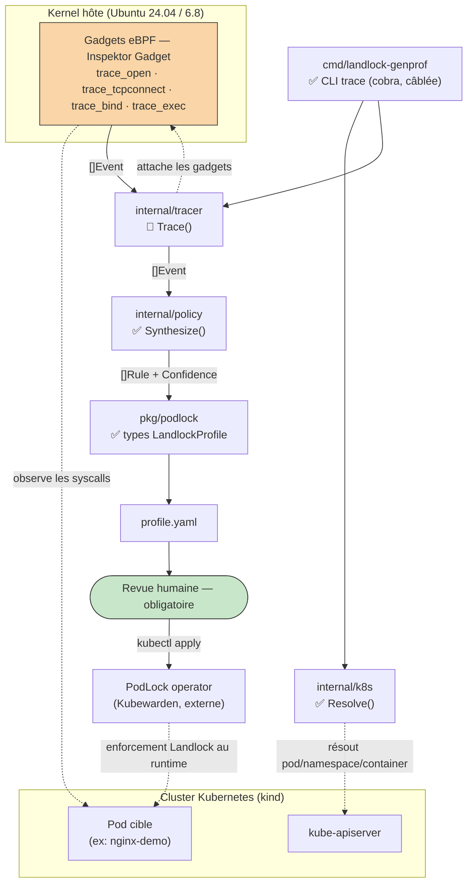
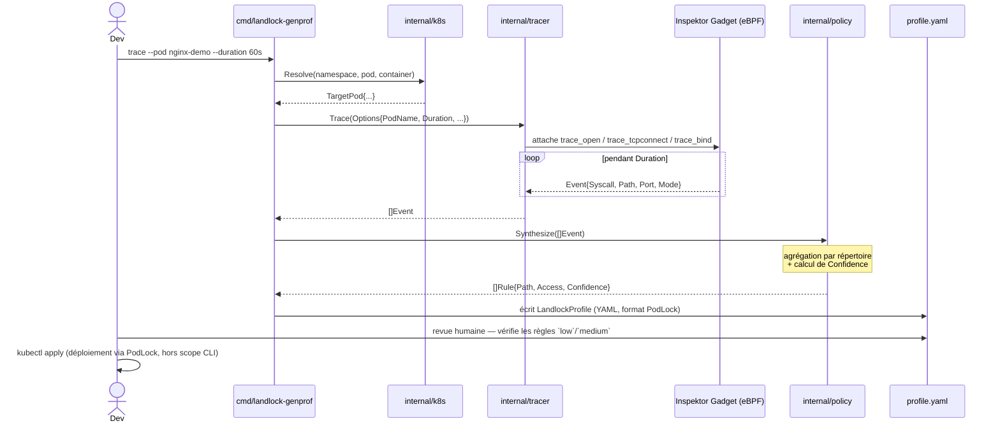
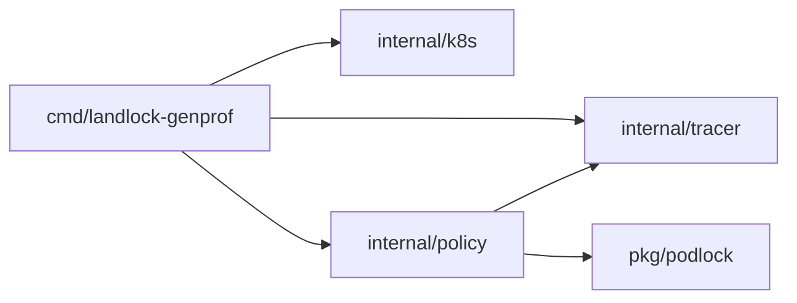

# Architecture

Ce document décrit l'architecture **cible** du pipeline (jalons M1-M4, voir
[`roadmap.md`](roadmap.md)). À date, seuls les types et les signatures de
fonctions existent dans le code (`panic("not implemented")` partout) — voir
la légende de chaque diagramme pour ce qui est réellement câblé.

---

## 1. Flux de données — composants et frontière de confiance

**Légende :** ✅ implémenté · 🚧 types/signatures définis, logique = stub
(`panic("not implemented")`).

**Frontière de confiance à noter** (détail dans
[`threat-model.md`](threat-model.md)) : le tracer nécessite des capacités
élevées (`CAP_BPF`, `CAP_SYS_ADMIN` selon le kernel) pour attacher les
gadgets eBPF — c'est la seule brique du pipeline qui touche directement au
kernel hôte et au pod observé. Tout le reste (synthèse, génération YAML)
tourne avec les privilèges normaux du process CLI.

---

## 2. Séquence d'un training run complet

Le CLI **s'arrête à l'écriture du YAML** — il n'appelle jamais `kubectl
apply` lui-même (voir README §5, "revue humaine obligatoire").

---

## 3. Dépendances entre packages Go

`internal/policy` importe désormais `pkg/podlock` (`ToProfile`/`ToYAML`,
voir `internal/policy/export.go`) — le pont vers `LandlockProfile` annoncé
comme "prévu M2" est câblé. `cmd/landlock-genprof` ne dépend de `podlock`
que transitivement (via la valeur retournée par `policy.ToProfile`) : il
n'a jamais besoin de l'importer directement, Go ne l'exige pas pour
manipuler une valeur d'un type qu'on ne nomme pas explicitement.

`Synthesize()` (agrégation événements → règles) et le CLI `trace` (voir
`cmd/landlock-genprof/trace.go`) sont implémentés — voir
[`docs/policy-synthesis.md`](policy-synthesis.md) pour le détail de
l'algorithme de synthèse et ses limites connues (heuristique de confiance
mono-run, profondeur d'agrégation empirique). Seul `internal/tracer.Trace()`
reste un stub : le CLI l'appelle et propage son `panic` tel quel, ce qui est
volontaire (voir docs/policy-synthesis.md et la note dans trace.go).
