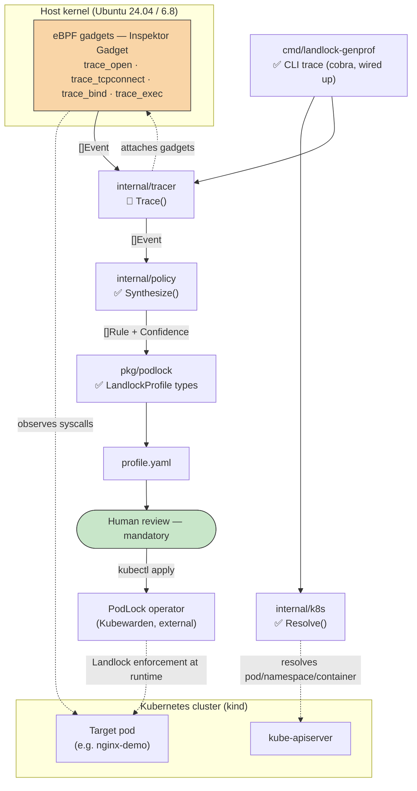
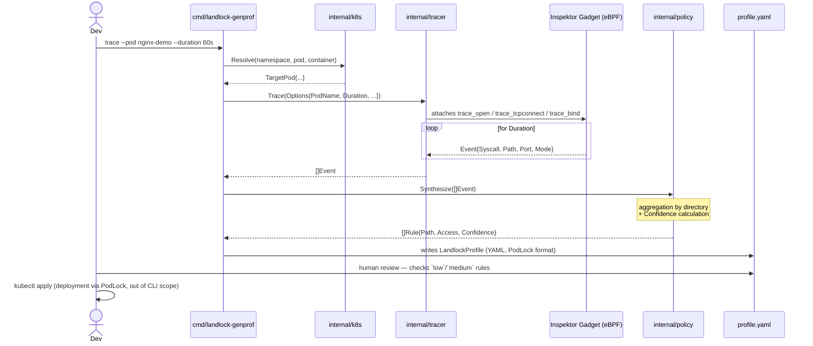
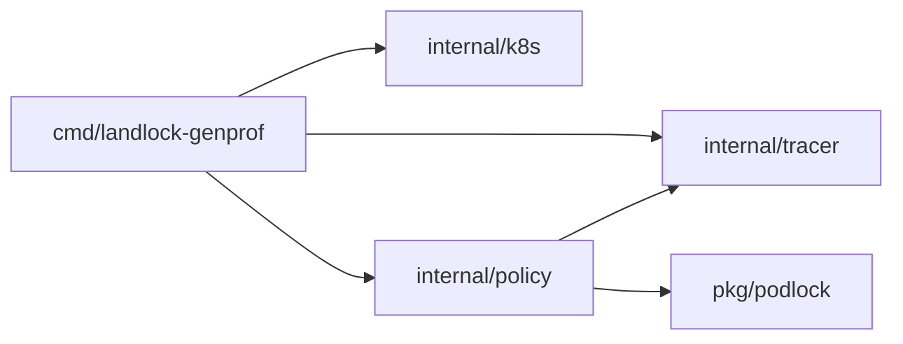

# Architecture

This document describes the **target** pipeline architecture (milestones M1-M4,
see [`roadmap.md`](roadmap.md)). As of now, only types and function signatures
exist in the code (`panic("not implemented")` everywhere) — see each diagram's
legend for what's actually wired up.

---

## 1. Data flow — components and trust boundary

**Legend:** ✅ implemented · 🚧 types/signatures defined, logic = stub
(`panic("not implemented")`).

**Trust boundary worth noting** (details in
[`threat-model.md`](threat-model.md)): the tracer needs elevated
capabilities (`CAP_BPF`, `CAP_SYS_ADMIN` depending on the kernel) to attach
eBPF gadgets — it's the only piece of the pipeline that touches the host
kernel and the observed pod directly. Everything else (synthesis, YAML
generation) runs with the CLI process's normal privileges.

---

## 2. Sequence of a full training run

The CLI **stops at writing the YAML** — it never calls `kubectl apply`
itself (see README §5, "mandatory human review").

---

## 3. Go package dependencies

`internal/policy` now imports `pkg/podlock` (`ToProfile`/`ToYAML`, see
`internal/policy/export.go`) — the bridge to `LandlockProfile` previously
flagged as "planned M2" is wired up. `cmd/landlock-genprof` only depends
on `podlock` transitively (via the value returned by `policy.ToProfile`):
it never needs to import it directly, since Go doesn't require importing
a package to hold a value of a type you never name explicitly.

`Synthesize()` (event aggregation → rules) and the `trace` CLI (see
`cmd/landlock-genprof/trace.go`) are implemented — see
[`docs/policy-synthesis.md`](policy-synthesis.md) for the synthesis
algorithm's details and known limitations (single-run confidence
heuristic, empirical aggregation depth). Only `internal/tracer.Trace()`
remains a stub: the CLI calls it and propagates its `panic` as-is, which
is intentional (see docs/policy-synthesis.md and the note in trace.go).
