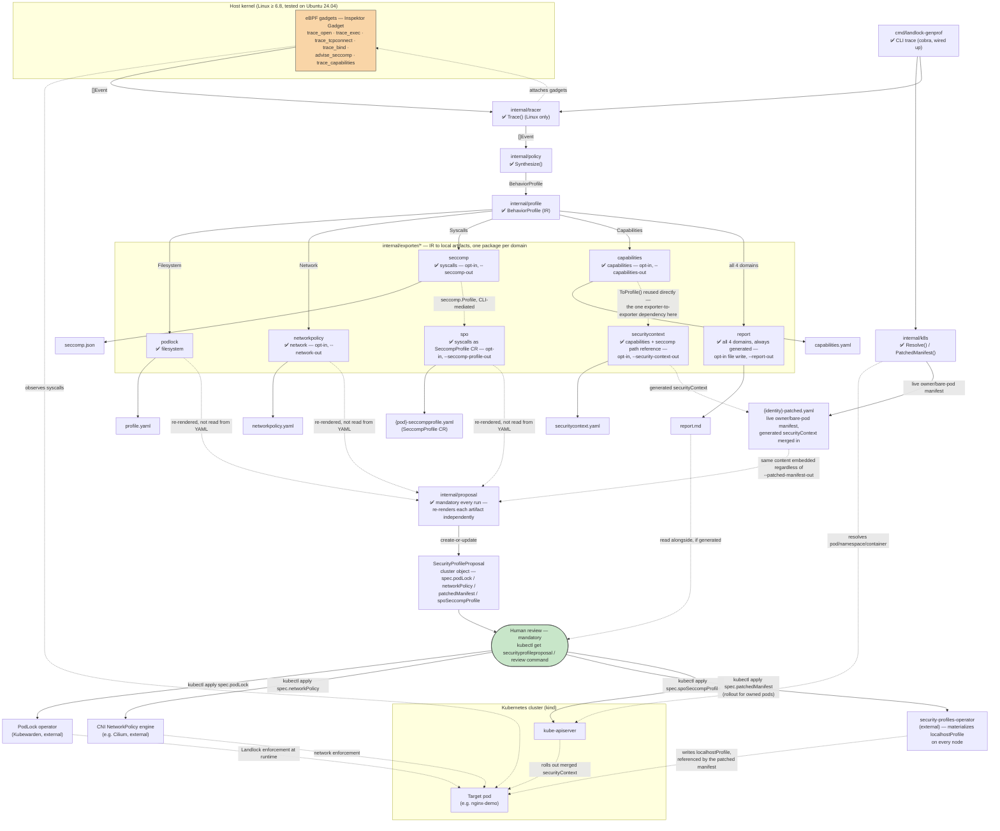

# Architecture

This document describes the pipeline architecture (milestones M1-M4, see
[`roadmap.md`](roadmap.md)) — see each diagram's legend for what's actually
wired up vs still planned.

---

## 1. Data flow — components and trust boundary

**Legend:** ✅ implemented — every component below is (no stubs left as
of this writing; a future stub would use 🚧). Dotted arrows are indirect/out-of-process
relationships (network calls, reused-but-not-piped data, external
controllers reconciling); solid arrows are direct data flow within the
CLI process. `{pod}`/`{identity}` mean the same thing as `<pod>`/
`<identity>` used in prose elsewhere in this repo — mermaid's parser
doesn't accept angle brackets inside node/participant labels (confirmed:
they broke rendering on GitHub), so both diagrams in this doc use braces
instead.

Note on `trace_tcpconnect`/`trace_bind`: their field names in
`internal/tracer/trace_linux.go` (`dst.port`, `addr.port` — both nested,
neither the flat name first guessed) are now confirmed against a live
cluster, the same way `trace_open`/`trace_exec`'s were (see
`docs/roadmap.md` M1). A wrong field name now fails with a clear error
(`requireField`) instead of a nil-pointer panic.

**Trust boundary worth noting** (details in
[`threat-model.md`](threat-model.md)): the tracer needs elevated
capabilities (`CAP_BPF`, `CAP_SYS_ADMIN` depending on the kernel) to attach
eBPF gadgets — it's the only piece of the pipeline that touches the host
kernel and the observed pod directly. Everything else (synthesis, YAML
generation) runs with the CLI process's normal privileges.

**PodLock/CNI/SPO in this diagram are external and, except for the CNI,
not installed by this repo** — see
[`docs/enforcement-prerequisites.md`](enforcement-prerequisites.md) for
what each actually needs, and in PodLock's case, why its own docs advise
against this project's `kind`-based reference environment entirely.

---

## 2. Sequence of a full training run

Moved to [`sequence-diagram.md`](sequence-diagram.md) — this file had
grown to nearly half of `architecture.md`'s total length. It's the
call-by-call view of the `trace` pipeline, every optional `--*-out` flag
as its own branch, plus the reasoning behind each exporter's specific
dependencies. Skip it unless you're implementing or debugging the CLI
itself — §1 above is enough for the general shape.

---

## 3. Go package dependencies

Moved to [`packages.md`](packages.md), for the same reason as §2 above.
Which package imports what, and why: the Behavior IR boundary, the one
real exporter-to-exporter dependency (`securitycontext` reusing
`capabilities`), and why `internal/tracer` is split by build tag.
