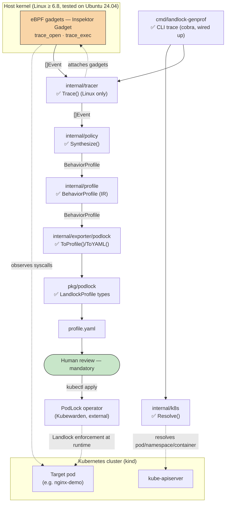
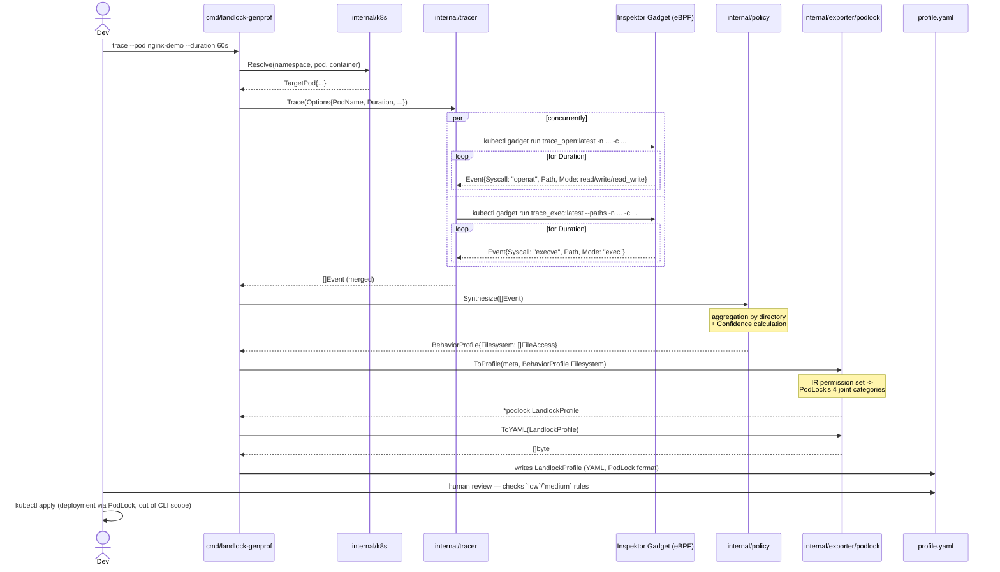
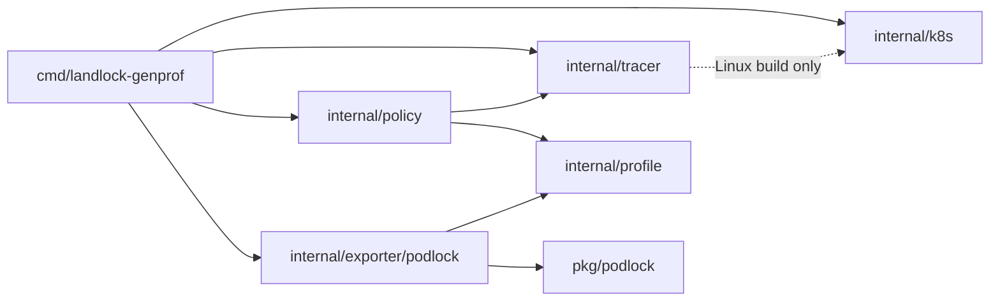

# Architecture

This document describes the pipeline architecture (milestones M1-M4, see
[`roadmap.md`](roadmap.md)) — see each diagram's legend for what's actually
wired up vs still planned.

---

## 1. Data flow — components and trust boundary

**Legend:** ✅ implemented · 🚧 types/signatures defined, logic = stub
(`panic("not implemented")`).

**Trust boundary worth noting** (details in
[`threat-model.md`](threat-model.md)): the tracer needs elevated
capabilities (`CAP_BPF`, `CAP_SYS_ADMIN` depending on the kernel) to attach
eBPF gadgets — it's the only piece of the pipeline that touches the host
kernel and the observed pod directly. Everything else (synthesis, YAML
generation) runs with the CLI process's normal privileges.

---

## 2. Sequence of a full training run

The CLI **stops at writing the YAML** — it never calls `kubectl apply`
itself (see README §5, "mandatory human review").

**`internal/policy` produces a Behavior IR, not a PodLock-shaped output**
(see §3 below and `docs/policy-synthesis.md`): `Synthesize()` returns an
`internal/profile.BehaviorProfile`, oblivious to PodLock. Converting that
IR into PodLock's specific YAML shape — including collapsing a
read/write/execute permission *set* into one of PodLock's four joint
categories (`readOnly`/`readWrite`/`readExec`/`readWriteExec`) — is
entirely `internal/exporter/podlock`'s job.

Current scope: `Trace()` runs `trace_open` (file read/write access) and
`trace_exec` (file execute access) concurrently, merging both into a
single `[]Event`. Network gadgets (`trace_tcpconnect`/`trace_bind`) are
deliberately not implemented — PodLock's real CRD has no field to
represent network rights at all, see `docs/policy-synthesis.md`.

**Why two gadgets, not one:** `openat(2)` has no "exec" bit in its flags
(`O_ACCMODE` only distinguishes read/write/read_write — unlike FreeBSD,
Linux has no `O_EXEC`). `trace_open` alone can therefore never tell us a
path was *executed*; that signal only exists on `execve(2)`/`execveat(2)`,
which is what `trace_exec` hooks. This was found the hard way: an earlier
version of `Synthesize()` already had a `"exec"` `Mode` case and a
`readExec`/`readWriteExec` output category, exercised only by
hand-crafted unit test events — no real code path in `trace_linux.go`
could ever actually produce `Mode: "exec"` until `trace_exec` was wired
in. See `docs/policy-synthesis.md`.

---

## 3. Go package dependencies

**The Behavior IR (`internal/profile`) is the boundary between
observation and output format.** `internal/policy` turns raw
`tracer.Event`s into an `internal/profile.BehaviorProfile` and knows
nothing else — no `pkg/podlock`, no YAML, no Kubernetes types.
`internal/exporter/podlock` is the only package that depends on *both*
`internal/profile` and `pkg/podlock`, and the dependency only ever runs
one way: exporter → IR. `internal/profile` itself has zero knowledge that
PodLock (or YAML, or Kubernetes) exists — enforced by a static import
check in `internal/profile/deps_test.go`, not just a convention. This is
what lets a second exporter (Kubernetes `NetworkPolicy`, Cilium,
`seccomp`, ...) be added later as a sibling of
`internal/exporter/podlock`, without touching `internal/policy` or
`internal/profile` at all.

`cmd/landlock-genprof` only depends on `pkg/podlock` transitively (via
the value returned by `podlock.ToProfile`, in `internal/exporter/podlock`):
it never needs to import `pkg/podlock` directly, since Go doesn't require
importing a package to hold a value of a type you never name explicitly.
Same reasoning for `internal/profile`: `cmd` holds a `BehaviorProfile`
value (returned by `policy.Synthesize`) without ever importing
`internal/profile` itself.

`internal/tracer.Trace()` calls `k8s.RestConfig()` to get the same
in-cluster/kubeconfig resolution `cmd`'s own client uses (factored into
`internal/k8s/config.go` specifically to avoid duplicating that logic in
both places).

### `internal/tracer` is split by build tag — and that's deliberate

- `tracer.go`: `Event`/`Options` types only, zero external imports.
- `trace_linux.go` (`//go:build linux`): the real implementation, using
  the Inspektor Gadget Go SDK (`pkg/gadget-context`, `pkg/runtime/grpc`,
  ...) to run `trace_open:latest` and `trace_exec:latest` concurrently
  against the cluster's already-deployed Inspektor Gadget DaemonSet — the
  programmatic equivalent of running
  `kubectl gadget run trace_open:latest -n <ns> -c <container>` and
  `kubectl gadget run trace_exec:latest --paths -n <ns> -c <container>`
  side by side and merging their output.
- `trace_other.go` (`//go:build !linux`): returns a clear error instead of
  running anything.

This isn't cosmetic. The Inspektor Gadget SDK transitively pulls in
Linux-only syscall code (eBPF, cgroups, ...) that doesn't compile at all
on macOS/Windows — a plain `import` of it in a file with no build tag
would break `go build`/`go test` for **every** package that depends on
`internal/tracer`, which includes `internal/policy` (for the `Event`
type) and therefore `cmd` too. Splitting the file means only the real
capture logic is Linux-gated; the plain data types and anything built on
top of them keep compiling everywhere. This mirrors reality: Landlock and
eBPF only exist on Linux, so real tracer work only ever happens on the dev
VM (see `HOW_TO_START.md`) or in CI (`ubuntu-24.04`) — but that shouldn't
force every *other* package to become Linux-only along with it.
