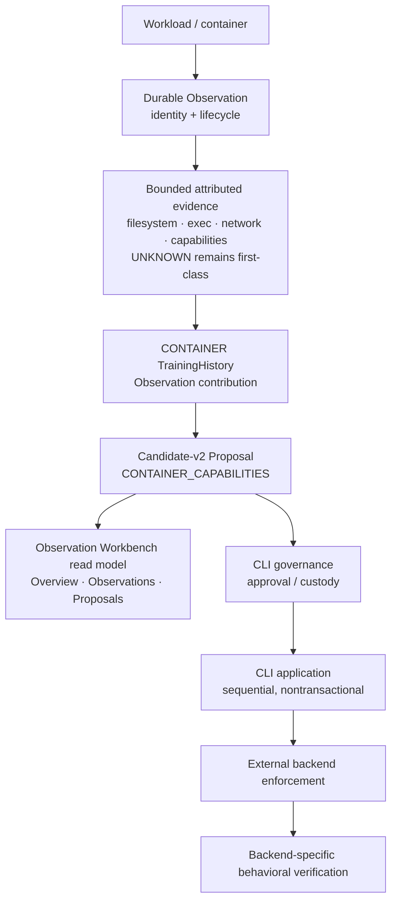
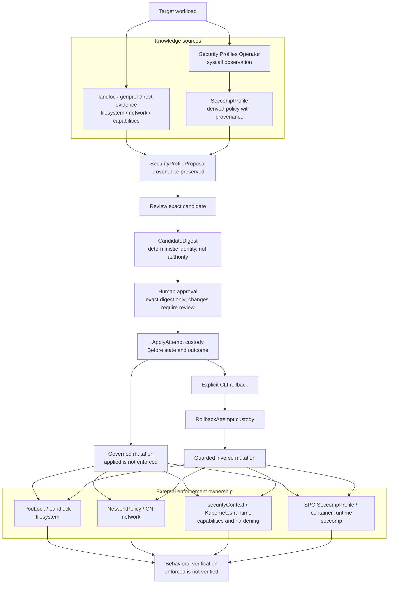

# Architecture

landlock-genprof is an evidence-driven governance and verification layer for
Kubernetes workload security policies. The v0.7 product surface is the
Observation Workbench; the existing CLI remains the downstream governance and
application path.

> **Central invariant:** learned policy is not authorized policy. Observed, derived, proposed, reviewed, approved, applied, enforced, and verified are distinct states.

Demonstrated behavior is tracked in [PROGRESS.md](PROGRESS.md). Normative apply ordering and SPO import boundaries are defined by [ADR-0007](adr/0007-governed-apply-ordering-and-enforcement-readiness.md) and [ADR-0008](adr/0008-spo-derived-policy-import-boundary.md).

## v0.7 Observation architecture


```mermaid
flowchart TD
    WORKLOAD["Workload / container"]
    OBS["Durable Observation\nidentity + lifecycle"]
    EVID["Bounded attributed evidence\nfilesystem · exec · network · capabilities\nUNKNOWN remains first-class"]
    HISTORY["CONTAINER TrainingHistory\nObservation contribution"]
    CANDIDATE["Candidate-v2 Proposal\nCONTAINER_CAPABILITIES"]
    READ["Observation Workbench read model\nOverview · Observations · Proposals"]
    APPROVAL["CLI governance\napproval / custody"]
    APPLY["CLI application\nsequential, nontransactional"]
    ENFORCE["External backend enforcement"]
    VERIFY["Backend-specific behavioral verification"]

    WORKLOAD --> OBS --> EVID --> HISTORY --> CANDIDATE --> READ
    CANDIDATE --> APPROVAL --> APPLY --> ENFORCE --> VERIFY
```

The Observation identity contains the exact workload UID, ContainerSlot, and
ImageIdentity. Candidate-v2 intentionally has asymmetric identity: its
Proposal subject is Scope `CONTAINER` plus Target, Container, and
ImageIdentity, and does not contain workload UID. The Workbench must preserve
that distinction rather than claim a stronger Proposal binding.

The Workbench exposes durable state and read-only governance facts. It does
not approve, reject, revoke, apply, or rollback. Those authorities remain in
the supported CLI/governance path.

## Downstream CLI, governance, and enforcement architecture


```mermaid
flowchart TD
    WORKLOAD["Target workload"]

    subgraph SOURCES["Knowledge sources"]
        DIRECT["landlock-genprof direct evidence<br/>filesystem / network / capabilities"]
        SPO["Security Profiles Operator<br/>syscall observation"]
        DERIVED["SeccompProfile<br/>derived policy with provenance"]
    end

    PROPOSAL["SecurityProfileProposal<br/>provenance preserved"]
    REVIEW["Review exact candidate"]
    DIGEST["CandidateDigest<br/>deterministic identity, not authority"]
    APPROVAL["Human approval<br/>exact digest only; changes require review"]
    CUSTODY["ApplyAttempt custody<br/>Before state and outcome"]
    APPLY["Governed mutation<br/>applied is not enforced"]
    ROLLBACK["Explicit CLI rollback"]
    ROLLBACKCUSTODY["RollbackAttempt custody"]
    INVERSE["Guarded inverse mutation"]

    subgraph BACKENDS["External enforcement ownership"]
        FILESYSTEM["PodLock / Landlock<br/>filesystem"]
        NETWORK["NetworkPolicy / CNI<br/>network"]
        HARDENING["securityContext / Kubernetes runtime<br/>capabilities and hardening"]
        SECCOMP["SPO SeccompProfile / container runtime<br/>seccomp"]
    end

    VERIFY["Behavioral verification<br/>enforced is not verified"]

    WORKLOAD --> DIRECT
    WORKLOAD --> SPO
    SPO --> DERIVED
    DIRECT --> PROPOSAL
    DERIVED --> PROPOSAL
    PROPOSAL --> REVIEW
    REVIEW --> DIGEST
    DIGEST --> APPROVAL
    APPROVAL --> CUSTODY
    CUSTODY --> APPLY
    APPLY --> FILESYSTEM
    APPLY --> NETWORK
    APPLY --> HARDENING
    APPLY --> SECCOMP
    FILESYSTEM --> VERIFY
    NETWORK --> VERIFY
    HARDENING --> VERIFY
    SECCOMP --> VERIFY
    CUSTODY --> ROLLBACK
    ROLLBACK --> ROLLBACKCUSTODY
    ROLLBACKCUSTODY --> INVERSE
    INVERSE --> FILESYSTEM
    INVERSE --> NETWORK
    INVERSE --> HARDENING
    INVERSE --> SECCOMP
```

### 1. Acquisition sources

In the primary SPO mode, landlock-genprof traces filesystem and network behavior while SPO observes syscalls with its recorder and produces the real derived `SeccompProfile`. The sources have different epistemic types: tracer events are observations; the SPO profile is already derived policy.

The internal path remains supported as an explicit alternative: `--seccomp-source=internal` lets the landlock-genprof tracer observe syscalls and synthesize an advisory seccomp artifact. It is not silently selected when SPO is unavailable. Source selection is explicit and visible in provenance.

### 2. Evidence versus derived policy

Direct filesystem and network observations may enter `TrainingHistory`, where cross-run occurrence supports confidence. An SPO-derived profile enters at the artifact layer. Its syscalls never enter landlock-genprof `TrainingHistory`, and landlock-genprof does not invent confidence or occurrence data for them. Coverage is optional provenance: official SPO v1.0.0 output may be absent, while the tested #3355-compatible merged path normalizes schema v1 without turning coverage into confidence, lineage, or authority.

Import copies validated enforcement semantics and provenance into a governed snapshot. It is not a live reference: later mutation or deletion of the SPO source object does not change an existing candidate. landlock-genprof does not mutate the source object, and that object grants no deployment authority.

### 3. Proposal assembly and identity

`trace` publishes the available filesystem, network, seccomp, capability, and workload-binding artifacts in one `SecurityProfileProposal`. Mixed origin is preserved: a candidate can combine landlock-genprof observations with SPO-derived seccomp policy without claiming they came from the same source.

`CandidateDigest` deterministically binds the proposal fields selected by the `candidate-v1` contract, including the governed SPO artifact, its provenance, and the patched manifest that refers to its governed profile name. The digest is content identity, not approval.

### 4. Review and authorization

`review` exposes the candidate and digest. `approve --expected-digest …` records explicit human authority for that exact content. A changed candidate produces a different digest and cannot inherit the earlier approval. Missing, malformed, revoked, or stale authority fails closed.

### 5. Governed apply

`apply-proposal` is the authoritative application path. It validates approval before planning, uses an immutable planned payload, applies enforcement artifacts before the optional workload-binding manifest, waits for supported backend readiness, rechecks live identity, and revalidates authority immediately before binding. Readiness is an execution precondition, never a source of authority.

Multi-artifact apply is sequential, not transactional. A failure stops subsequent application and prevents workload binding, but resources applied before the failure are not rolled back.

### 6. External enforcement and verification

landlock-genprof is not a kernel enforcement mechanism:

| Domain | Artifact | Enforcement owner |
|---|---|---|
| Filesystem | PodLock `LandlockProfile` | PodLock / Landlock integration |
| Network | Kubernetes `NetworkPolicy` | The cluster CNI |
| Syscalls | SPO `SeccompProfile` plus workload reference | SPO, kubelet, and container runtime |
| Capabilities | `securityContext` fragment or patched workload | Kubernetes and the container runtime |

Applied does not mean enforced, and enforced does not mean verified. Backend reconciliation establishes readiness for supported paths; behavioral verification separately establishes what restriction the workload actually experiences. See [enforcement prerequisites](enforcement-prerequisites.md) and [demonstrated capabilities](PROGRESS.md).

### 7. ApplyAttempt custody and explicit rollback

`apply-proposal` records durable `ApplyAttempt` custody before each governed
mutation. The record preserves canonical target identity, controlled Before
state, intended and observed state, resource identity, resourceVersion, and
typed outcome. A current custody epoch qualifies newly created attempts for
explicit rollback; it is a qualification marker, not authority.

An explicit CLI rollback creates a separate `RollbackAttempt`. It validates
strict UID/resourceVersion and controlled-state equality before each inverse,
uses dependency/readiness and policy-reference guards, and restores only the
recorded controlled Before state. Both apply and rollback are sequential and
nontransactional; partial and unknown outcomes remain durable.

### 8. Observation Workbench presentation adapter

The v0.7 Observation Workbench is a read-only projection over canonical
workload resolution, durable namespace-scoped Observations, Proposal state,
evidence, uncertainty, and read-only governance facts. It performs reads through the
pinned `WorkbenchReadCapability` and does not expose a Kubernetes mutation
client or browser mutation route:

```text
Kubernetes API / kubeconfig
          │ bounded namespace-scoped reads
          ▼
Canonical workload/container target
          ├── durable Observation lifecycle and evidence
          ├── candidate-v2 Proposal and provenance
          └── read-only governance facts
                          │
                          ▼
                    workbenchView
                          │
                          ▼
                    html/template
                          │
                          ▼
                   127.0.0.1 HTTP
                          │
                          ▼
                       Browser
```

The Workbench owns none of the candidate digest, approval, provenance,
coverage, custody, or Kubernetes mutation semantics. Its HTTP application
capability is read-only, namespace-pinned, and bounded by request,
concurrency, response, and timeout controls. Browser interaction cannot
approve, reject, revoke, apply, rollback, or activate custody. The v0.7
navigation is Overview, Observations, and Proposals; there are no standalone
Governance, Activity, or Assurance experiences. The page is not a controller,
generic dashboard, approval interface, or source of new policy meaning.

## Engineering references

- [Detailed data flow](data-flow-diagram.md) — package, artifact, and RBAC boundaries.
- [Runtime sequence](sequence-diagram.md) — implementation-level trace flow and optional branches.
- [Package map](packages.md) — Go dependency boundaries.
- [Policy synthesis](policy-synthesis.md) — direct-evidence aggregation and confidence semantics.

These references describe implementation detail; this page owns the current product architecture.

## Future architecture

Controller reconciliation, continuous drift handling, detection, and governed response are roadmap capabilities, not current architecture. They must preserve source attribution, candidate identity, explicit human authority, and the separation between application, enforcement, and verification.
