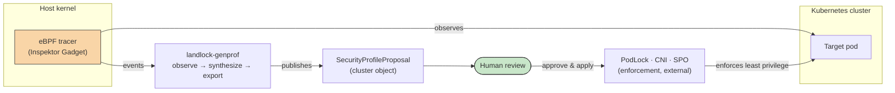

# Architecture

This document describes the pipeline architecture (milestones M1-M4, see
[`roadmap.md`](roadmap.md)) — see each diagram's legend for what's actually
wired up vs still planned.

**In short:** an eBPF tracer observes a pod, the CLI turns that into
profiles and publishes them for review, a human approves and applies,
external operators (PodLock/CNI/SPO) enforce. §1's first diagram below
is the whole picture in one screen — read that and stop there unless
you're implementing or debugging the CLI itself, in which case §1's
second diagram and §2/§3 go one level deeper.

---

## 1. Components and interactions

```mermaid
flowchart LR
    subgraph cluster["Kubernetes cluster"]
        POD["Target pod"]
    end
    subgraph hostkernel["Host kernel"]
        EBPF["eBPF tracer<br/>(Inspektor Gadget)"]
    end
    CLI["landlock-genprof<br/>observe → synthesize → export"]
    PROPOSAL["SecurityProfileProposal<br/>(cluster object)"]
    HUMAN(["Human review"])
    ENFORCE["PodLock · CNI · SPO<br/>(enforcement, external)"]

    EBPF -- "observes" --> POD
    EBPF -- "events" --> CLI
    CLI -- "publishes" --> PROPOSAL
    PROPOSAL --> HUMAN
    HUMAN -- "approve & apply" --> ENFORCE
    ENFORCE -- "enforces least privilege" --> POD

    style EBPF fill:#f9d5a7,stroke:#333
    style HUMAN fill:#c8e6c9,stroke:#333
```

- **Target pod** — what gets observed; untouched by this tool until a
  human applies something, later.
- **eBPF tracer (Inspektor Gadget)** — attaches for the training run's
  duration, reports raw filesystem/network/syscall/capability events.
  The only component that touches the host kernel and the pod directly.
- **`landlock-genprof`** — turns those events into least-privilege
  profiles and publishes them. Everything else in the CLI process runs
  with normal privileges, not the tracer's elevated ones.
- **`SecurityProfileProposal`** — a cluster object holding every
  generated artifact from a run, reviewable via `kubectl`/GitOps — not
  just local files.
- **Human review** — mandatory, not optional. Nothing here is ever
  applied automatically.
- **PodLock / CNI / security-profiles-operator** — external operators
  that actually enforce whatever a human approved. This project's job
  ends at generating the recommendation — see
  [`enforcement-prerequisites.md`](enforcement-prerequisites.md) for
  what each needs, none of which this repo installs by default.

Moved to [`data-flow-diagram.md`](data-flow-diagram.md) — the full
implementation-level diagram (every package, every generated file,
every RBAC boundary) and its accompanying notes. Skip it unless you're
implementing or debugging the CLI itself — the diagram above is enough
for the general shape.

---

## 2. Sequence of a full training run

Moved to [`sequence-diagram.md`](sequence-diagram.md) — this file had
grown to nearly half of `architecture.md`'s total length. It's the
call-by-call view of the `trace` pipeline, every optional `--*-out` flag
as its own branch, plus the reasoning behind each exporter's specific
dependencies. Skip it unless you're implementing or debugging the CLI
itself — §1 above is enough for the general shape.

---

## 3. Go package dependencies

Moved to [`packages.md`](packages.md), for the same reason as §2 above.
Which package imports what, and why: the Behavior IR boundary, the one
real exporter-to-exporter dependency (`securitycontext` reusing
`capabilities`), and why `internal/tracer` is split by build tag.

---

## 4. Where this is headed: `internal/landlock`

The Behavior IR (`internal/profile`) described above is generic and
cross-domain by design — that's correct for `internal/policy.Synthesize`
internally, but this project is **not** publishing that shape as a
stable public API. A dedicated, filesystem-only synthesis kernel
(`internal/landlock`) is being extracted instead, staged so no public
commitment is made before it's earned one. See
[`landlock-kernel-extraction.md`](landlock-kernel-extraction.md) for the
full decision record and current phase status — nothing in §§1-3 above
changes until that extraction actually reaches the packages it touches.
