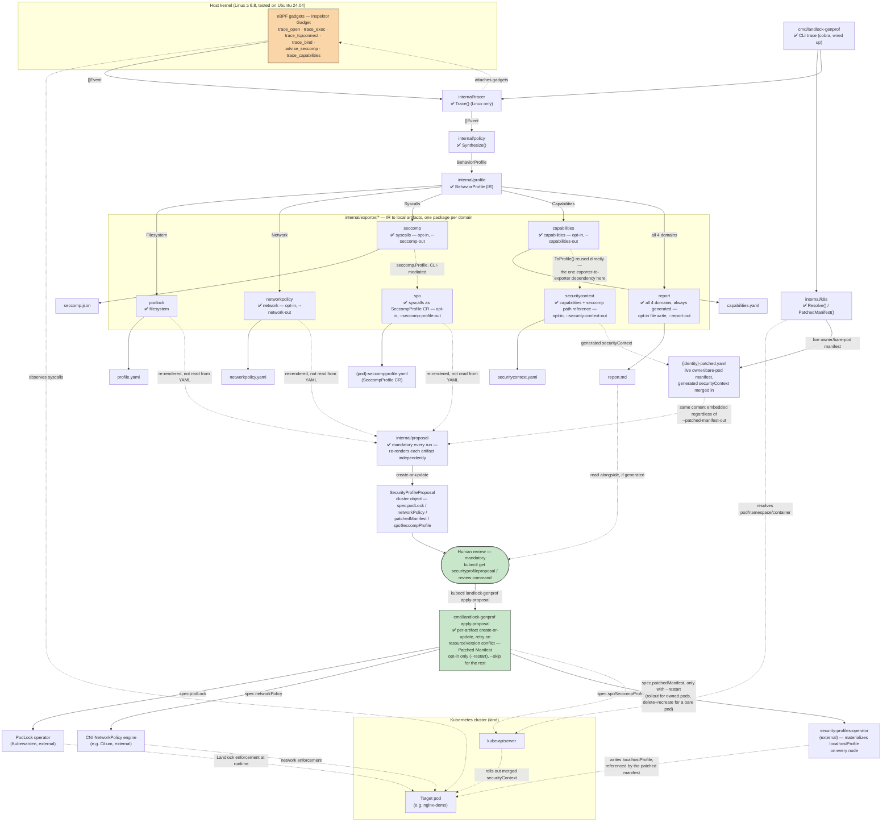

# Full data-flow diagram

Split out of [`architecture.md`](architecture.md) §1, which had grown
too long once the full implementation-level diagram sat right
alongside the overview one — this is every package, every generated
file, every RBAC boundary, for implementing or debugging the CLI
itself. For the high-level picture, [`architecture.md`](architecture.md)
§1's own first diagram is enough.

**Legend:** ✅ implemented — every component below is (no stubs left as
of this writing; a future stub would use 🚧). Dotted arrows are indirect/out-of-process
relationships (network calls, reused-but-not-piped data, external
controllers reconciling); solid arrows are direct data flow within the
CLI process. `{pod}`/`{identity}` mean the same thing as `<pod>`/
`<identity>` used in prose elsewhere in this repo — mermaid's parser
doesn't accept angle brackets inside node/participant labels (confirmed:
they broke rendering on GitHub), so both diagrams in this doc use braces
instead.

Note on `trace_tcpconnect`/`trace_bind`: their field names in
`internal/tracer/trace_linux.go` (`dst.port`, `addr.port` — both nested,
neither the flat name first guessed) are now confirmed against a live
cluster, the same way `trace_open`/`trace_exec`'s were (see
`docs/roadmap.md` M1). A wrong field name now fails with a clear error
(`requireField`) instead of a nil-pointer panic.

**Trust boundary worth noting** (details in
[`threat-model.md`](threat-model.md)): the tracer needs elevated
capabilities (`CAP_BPF`, `CAP_SYS_ADMIN` depending on the kernel) to attach
eBPF gadgets — it's the only piece of the pipeline that touches the host
kernel and the observed pod directly. Everything else (synthesis, YAML
generation) runs with the CLI process's normal privileges.

**PodLock/CNI/SPO in this diagram are external and, except for the CNI,
not installed by this repo** — see
[`enforcement-prerequisites.md`](enforcement-prerequisites.md) for
what each actually needs, and in PodLock's case, why its own docs advise
against this project's `kind`-based reference environment entirely.
