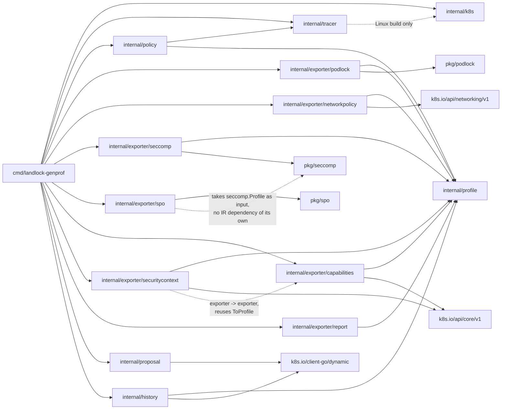

# Go package dependencies

Split out of [`architecture.md`](architecture.md) §3, for the same
reason [`sequence-diagram.md`](sequence-diagram.md) was split out of
§2 — that file had grown to nearly half of `architecture.md`'s length.
This is the code-organization view: which package imports what, and why.

**The Behavior IR (`internal/profile`) is the boundary between
observation and output format.** `internal/policy` turns raw
`tracer.Event`s into an `internal/profile.BehaviorProfile` and knows
nothing else — no `pkg/podlock`, no YAML, no Kubernetes types.
`internal/exporter/podlock`, `internal/exporter/networkpolicy`,
`internal/exporter/seccomp`, and `internal/exporter/capabilities` are the
only packages that depend on both `internal/profile` and an
output-specific type (`pkg/podlock`, the already-vendored
`k8s.io/api/networking/v1`, the hand-rolled `pkg/seccomp` — small and
stable enough not to need a vendored dependency, same reasoning as
`pkg/podlock` — or the already-vendored `k8s.io/api/core/v1.Capabilities`),
and the dependency only ever runs one way: exporter → IR.
`internal/profile` itself has zero knowledge that PodLock, `NetworkPolicy`,
seccomp, Linux capabilities, YAML, or Kubernetes exist — enforced by a
static import check in `internal/profile/deps_test.go`, not just a
convention. This is what let `internal/exporter/networkpolicy`,
`internal/exporter/seccomp`, and `internal/exporter/capabilities` each be
added as a sibling of `internal/exporter/podlock` without touching
`internal/policy` or `internal/profile`'s import graph at all — only
their exported surface grew (`BehaviorProfile.Network`, then
`BehaviorProfile.Syscalls`, then `BehaviorProfile.Capabilities`). Cilium
remains an unimplemented future sibling of the same shape.
`internal/exporter/securitycontext` is the one exception to "exporters
only ever depend on the IR": it additionally depends on
`internal/exporter/capabilities` directly, to reuse its `ToProfile`
rather than duplicate the same conversion logic — see
[`sequence-diagram.md`](sequence-diagram.md)'s note on why it composes
instead of merging.
`internal/exporter/report` is a third, even simpler shape: it depends on
`internal/profile` and *nothing else* — no output-specific type at all,
vendored or hand-rolled, since Markdown text has no corresponding Go
type to convert into. It presents the IR's own data directly rather
than converting it, which is also why it doesn't reuse any of the other
four exporters' logic the way `securitycontext` does.
`internal/exporter/spo` is a fourth shape, and the most different one:
it depends on `pkg/seccomp` but **not on `internal/profile` at all** —
unlike every other exporter, it never sees the IR, only
`internal/exporter/seccomp.ToProfile`'s already-converted `*seccomp.
Profile` output, which it re-wraps as an SPO `SeccompProfile` custom
resource (`pkg/spo`) instead of re-deriving the same conversion from
raw `BehaviorProfile.Syscalls` a second time — the same "reuse, don't
duplicate" reasoning `securitycontext` already applies to
`capabilities`, just one exporter further down the chain.

**`internal/history` is shaped like an exporter (depends on the IR, not
the other way — no changes needed to `internal/policy`/`internal/profile`
to add it), but it isn't one**: it reads back what it wrote on a previous
run (`history.Get`) as well as producing something new
(`history.Merge`/`Save`). `ApplyConfidence`'s output *is* wired into all
six exporters now (`cmd/landlock-genprof/trace.go`'s `recordHistory`
updates the shared `behavior` value once, before any exporter runs) —
`internal/exporter/podlock`/`internal/exporter/networkpolicy`/
`internal/exporter/capabilities`/`internal/exporter/securitycontext`
surface it as a `# confidence: ...` YAML comment, `internal/exporter/seccomp`
can't (its output must stay plain JSON) and prints it to stdout instead,
and `internal/exporter/report` shows it directly as a table column, plus
the `--history`-aware checklist/header notes described above (see
`docs/policy-synthesis.md`).
Its own `k8s.io/client-go/dynamic`
dependency is because `TrainingHistory` is this project's own CRD with no
generated typed client, unlike `internal/k8s`'s typed
`kubernetes.Interface` — the same reason `internal/exporter/podlock`
needed hand-rolled types for PodLock's CRD but
`internal/exporter/networkpolicy` didn't for the already-vendored
`NetworkPolicy` type.

**`internal/proposal` is the one package in this diagram that never
touches `internal/profile`, or any output-specific type, at all.**
Every exporter and `internal/history` depends on the IR, directly or
(per `cmd`'s own case, next paragraph) transitively — `internal/proposal`
doesn't, because `cmd`'s own `publishProposal` does the `BehaviorProfile`
→ rendered-text conversion itself, by calling the exporters' own
`ToProfile`+`ToYAML`/`ToPolicy`+`ToYAML`/`ToJSON` functions a second
time (redundant computation, not a refactor of those — see
[`sequence-diagram.md`](sequence-diagram.md)).
`internal/proposal` only ever receives plain `string`s and stores
them — its own `types.go` has no `pkg/podlock`/`k8s.io/api/...`/
`pkg/seccomp` imports at all, simpler than even `internal/history`,
which at least has its own `Merge`/`ApplyConfidence` logic operating on
the IR directly. Its only real dependency is
`k8s.io/client-go/dynamic`, for the same reason `internal/history` has
it: talking to a CRD with no generated typed client.

`cmd/landlock-genprof` only depends on `pkg/podlock` transitively (via
the value returned by `podlock.ToProfile`, in `internal/exporter/podlock`):
it never needs to import `pkg/podlock` directly, since Go doesn't require
importing a package to hold a value of a type you never name explicitly.
Same reasoning for `internal/profile`: `cmd` holds a `BehaviorProfile`
value (returned by `policy.Synthesize`) without ever importing
`internal/profile` itself.

`internal/tracer.Trace()` calls `k8s.RestConfig()` to get the same
in-cluster/kubeconfig resolution `cmd`'s own client uses (factored into
`internal/k8s/config.go` specifically to avoid duplicating that logic in
both places).

## `internal/tracer` is split by build tag — and that's deliberate

- `tracer.go`: `Event`/`Options` types only, zero external imports.
- `trace_linux.go` (`//go:build linux`): the real implementation, using
  the Inspektor Gadget Go SDK (`pkg/gadget-context`, `pkg/runtime/grpc`,
  ...) to run `trace_open:latest`, `trace_exec:latest`,
  `trace_tcpconnect:latest`, and `trace_bind:latest` concurrently against
  the cluster's already-deployed Inspektor Gadget DaemonSet — the
  programmatic equivalent of running all four `kubectl gadget run ...`
  invocations side by side and merging their output.
- `trace_other.go` (`//go:build !linux`): returns a clear error instead of
  running anything.

This isn't cosmetic. The Inspektor Gadget SDK transitively pulls in
Linux-only syscall code (eBPF, cgroups, ...) that doesn't compile at all
on macOS/Windows — a plain `import` of it in a file with no build tag
would break `go build`/`go test` for **every** package that depends on
`internal/tracer`, which includes `internal/policy` (for the `Event`
type) and therefore `cmd` too. Splitting the file means only the real
capture logic is Linux-gated; the plain data types and anything built on
top of them keep compiling everywhere. This mirrors reality: Landlock and
eBPF only exist on Linux, so real tracer work only ever happens on the dev
VM (see `HOW_TO_START.md`) or in CI (`ubuntu-24.04`) — but that shouldn't
force every *other* package to become Linux-only along with it.
