# Sequence of a full training run

Split out of [`architecture.md`](architecture.md) §2, which had grown to
nearly half that file's length — this is the detailed, call-by-call view
for implementing or debugging the CLI itself. For the high-level picture,
[`architecture.md`](architecture.md) §1 is enough.

`{pod}`/`{identity}` below are placeholders substituted with the real pod
name / target identity at runtime — same meaning as `<pod>`/`<identity>`
used in prose elsewhere in this repo, just without angle brackets, which
mermaid's sequence-diagram parser doesn't accept inside a
`participant ... as ...` alias (confirmed: they broke rendering on
GitHub).

```mermaid
sequenceDiagram
    actor Dev
    participant CLI as cmd/landlock-genprof
    participant K8s as internal/k8s
    participant Tracer as internal/tracer
    participant IG as Inspektor Gadget (eBPF)
    participant Policy as internal/policy
    participant Exp as internal/exporter/podlock
    participant FS as profile.yaml
    participant NetExp as internal/exporter/networkpolicy
    participant NetFS as networkpolicy.yaml
    participant SecExp as internal/exporter/seccomp
    participant SecFS as seccomp.json
    participant SecCRExp as internal/exporter/spo
    participant SecCRFS as {pod}-seccompprofile.yaml
    participant CapExp as internal/exporter/capabilities
    participant CapFS as capabilities.yaml
    participant SCExp as internal/exporter/securitycontext
    participant SCFS as securitycontext.yaml
    participant RepExp as internal/exporter/report
    participant RepFS as report.md
    participant Prop as internal/proposal
    participant K8sAPI as SecurityProfileProposal (cluster object)
    participant PatchFS as {identity}-patched.yaml

    Dev->>CLI: trace --pod nginx-demo --duration 60s --network-out networkpolicy.yaml --seccomp-out seccomp.json --seccomp-profile-out seccompprofile.yaml --capabilities-out capabilities.yaml --security-context-out securitycontext.yaml --report-out report.md
    CLI->>K8s: Resolve(namespace, pod, container)
    K8s-->>CLI: TargetPod{..., Labels}
    CLI->>Tracer: Trace(Options{PodName, Duration, ...})
    par concurrently
        Tracer->>IG: kubectl gadget run trace_open:latest -n ... -c ...
        loop for Duration
            IG-->>Tracer: Event{Syscall: "openat", Path, Mode: read/write/read_write}
        end
    and
        Tracer->>IG: kubectl gadget run trace_exec:latest --paths -n ... -c ...
        loop for Duration
            IG-->>Tracer: Event{Syscall: "execve", Path, Mode: "exec"}
        end
    and
        Tracer->>IG: kubectl gadget run trace_tcpconnect:latest -n ... -c ...
        loop for Duration
            IG-->>Tracer: Event{Syscall: "connect", Port, Mode: "egress"}
        end
    and
        Tracer->>IG: kubectl gadget run trace_bind:latest -n ... -c ...
        loop for Duration
            IG-->>Tracer: Event{Syscall: "bind", Port, Mode: "ingress"}
        end
    and
        Tracer->>IG: kubectl gadget run advise_seccomp:latest -n ... -c ...
        Note over IG: flush-on-stop: emits once,<br/>at the end of Duration
        IG-->>Tracer: advise.text = "// container\n{seccomp JSON}"
    and
        Tracer->>IG: kubectl gadget run trace_capabilities:latest -n ... -c ...
        loop for Duration
            IG-->>Tracer: Event{Syscall: "CAP_NET_BIND_SERVICE", Mode: "capability"}
        end
    end
    Tracer-->>CLI: []Event (merged), []string (architectures)
    CLI->>Policy: Synthesize([]Event, []string)
    Note over Policy: filesystem: aggregation by directory<br/>network: aggregation by (port, direction)<br/>syscalls: aggregation by name<br/>capabilities: aggregation by name<br/>+ Confidence calculation for all but syscalls (always low without --history)
    Policy-->>CLI: BehaviorProfile{Filesystem, Network, Syscalls, Capabilities}
    CLI->>Exp: ToProfile(meta, BehaviorProfile.Filesystem)
    Note over Exp: IR permission set -><br/>PodLock's 4 joint categories
    Exp-->>CLI: *podlock.LandlockProfile
    CLI->>Exp: ToYAML(LandlockProfile)
    Exp-->>CLI: []byte
    CLI->>FS: writes LandlockProfile (YAML, PodLock format)
    opt --network-out set and Network.Accesses non-empty
        CLI->>NetExp: ToPolicy(meta, BehaviorProfile.Network)
        Note over NetExp: one port per Ingress/Egress rule,<br/>podSelector from the traced pod's own labels
        NetExp-->>CLI: *networkingv1.NetworkPolicy
        CLI->>NetExp: ToYAML(NetworkPolicy)
        NetExp-->>CLI: []byte
        CLI->>NetFS: writes NetworkPolicy (YAML)
    end
    opt --seccomp-out set and Syscalls.Accesses non-empty
        CLI->>SecExp: ToProfile(BehaviorProfile.Syscalls)
        Note over SecExp: single SCMP_ACT_ALLOW rule,<br/>sorted syscall names
        SecExp-->>CLI: *seccomp.Profile
        CLI->>SecExp: ToJSON(Profile)
        SecExp-->>CLI: []byte
        CLI->>SecFS: writes seccomp profile (plain JSON, no comments)
        CLI->>Dev: prints not-yet-confirmed syscalls to stdout
    end
    Note over CLI: seccompLocalhostProfile = spo.LocalhostProfilePath(name, namespace),<br/>computed unconditionally whenever Syscalls.Accesses is non-empty —<br/>independent of --seccomp-out/--seccomp-profile-out, used below and in Prop
    opt --seccomp-profile-out set and Syscalls.Accesses non-empty
        CLI->>SecCRExp: ToSeccompProfile(meta, seccomp.Profile)
        Note over SecCRExp: reuses SecExp.ToProfile() output directly —<br/>field-for-field identical to SPO's own schema
        SecCRExp-->>CLI: *spo.SeccompProfile
        CLI->>SecCRExp: ToYAML(SeccompProfile)
        SecCRExp-->>CLI: []byte
        CLI->>SecCRFS: writes SeccompProfile custom resource (YAML)
    end
    opt --capabilities-out set and Capabilities.Accesses non-empty
        CLI->>CapExp: ToProfile(BehaviorProfile.Capabilities)
        Note over CapExp: drop: [ALL] always,<br/>add: sorted, CAP_ prefix stripped
        CapExp-->>CLI: *corev1.Capabilities
        CLI->>CapExp: ToYAML(Capabilities)
        CapExp-->>CLI: []byte
        CLI->>CapFS: writes capabilities fragment (YAML, confidence comments)
    end
    opt --security-context-out set and (Capabilities.Accesses non-empty or seccompLocalhostProfile set)
        CLI->>SCExp: ToSecurityContext(BehaviorProfile.Capabilities, seccompLocalhostProfile)
        Note over SCExp: reuses CapExp.ToProfile() internally —<br/>the one exporter-to-exporter dependency in this codebase
        SCExp-->>CLI: *corev1.SecurityContext
        CLI->>SCExp: ToYAML(SecurityContext)
        SCExp-->>CLI: []byte
        CLI->>SCFS: writes composed securityContext fragment (YAML, confidence comments)
    end
    opt --patched-manifest-out set and (Capabilities.Accesses non-empty or seccompLocalhostProfile set)
        CLI->>K8s: PatchedManifest(ctx, client, resolvedTarget, SecurityContext)
        Note over K8s: fetches the live owner (Deployment/StatefulSet/DaemonSet)<br/>or bare pod, merges sc into the target container only —<br/>every other existing securityContext field untouched
        K8s-->>CLI: identity, []byte
        CLI->>PatchFS: writes clean, ready-to-apply manifest (owner's, not the ephemeral pod's, when owned)
    end
    opt --report-out set
        Note over CLI: never skipped, even if every domain is empty —<br/>an empty domain is itself useful review content
        CLI->>RepExp: ToMarkdown(meta, BehaviorProfile, GeneratedFiles{...})
        Note over RepExp: one Markdown doc, all four domains,<br/>links to whichever sibling files were also written this run
        RepExp-->>CLI: []byte
        CLI->>RepFS: writes review report (Markdown)
    end
    Note over CLI: mandatory, not opt-in — re-renders each artifact (ToYAML/ToJSON) from BehaviorProfile independently,<br/>same conditions as the write* functions above — redundant, not a refactor
    CLI->>Prop: Save(ctx, client, namespace, target.PodName, Spec{PodLock: string(yamlBytes), ...})
    Note over Prop: create-or-update (overwrite on re-run, not accumulated) —<br/>via runtime.DefaultUnstructuredConverter, not a hand-rolled map
    Prop->>K8sAPI: Create or Update
    Note over CLI: run fails outright if this fails (missing CRD/RBAC) — no silent degrade to local files only
    Dev->>FS: human review — checks `low`/`medium` rules
    Dev->>NetFS: human review — checks generated ports/podSelector
    Dev->>SecFS: human review — checks syscalls flagged on stdout
    Dev->>SecCRFS: human review, then kubectl apply — requires security-profiles-operator installed to take effect
    Dev->>CapFS: human review — pastes add/drop under a container's own securityContext
    Dev->>SCFS: human review — pastes the composed fragment under a container's own securityContext
    Dev->>RepFS: human review — one combined pass across all four domains
    Dev->>K8sAPI: human review via kubectl/GitOps — first slice of an evidence/proposal/approved-policy model, no operator reads this yet
    Dev->>PatchFS: human review, then kubectl apply directly — a rollout for an owned pod, delete+recreate for a bare one
    Dev->>Dev: kubectl apply / node deployment / manual securityContext edit (out of CLI scope)
```

The CLI **stops at writing the YAML** — it never calls `kubectl apply`
itself (see README §5, "mandatory human review").

**`internal/exporter/securitycontext` composes rather than merges.**
The seccomp and capabilities exporters were deliberately *not* folded
into one backend: `corev1.SeccompProfile.LocalhostProfile` only ever
takes a path reference, never inline content ("Must be a descending
path, relative to the kubelet's configured seccomp profile location",
per its own doc comment in `k8s.io/api/core/v1`), so a true merge would
still produce two files — the seccomp JSON plus a wrapper referencing
it — just with more indirection. Instead, `securitycontext` is a third,
additive view: it reuses `internal/exporter/capabilities.ToProfile`
directly (this codebase's first exporter-to-exporter dependency — every
exporter before it only ever depended on `internal/profile`) and takes a
plain filename for the seccomp reference, computed by the CLI from
whatever `--seccomp-out` actually wrote this run — never a dangling
reference to a file that doesn't exist. `internal/exporter/seccomp` and
`internal/exporter/capabilities` are unchanged and still independently
usable on their own.

**`internal/k8s.PatchedManifest` goes one step further than the bare
`securityContext` fragment: a complete, ready-to-apply manifest.**
Deliberately lives in `internal/k8s`, not a new exporter — it isn't an
IR conversion, it fetches live cluster state (the target's owner, or
the bare pod itself) and patches it, reusing `DetectOwner`/`OwnerKind`
from `internal/k8s/restart.go` directly rather than reinventing the same
distinction. The key nuance: most container-spec fields, including
`securityContext`, are immutable on an already-running Pod, so for an
owned pod the artifact that's actually useful is the *owner's* manifest
(`kubectl apply` on it triggers a rollout, the real supported way to
change this) — not the ephemeral pod's own YAML. Merges, never replaces:
only `Capabilities`/`SeccompProfile` are ever set on the target
container, every other existing `securityContext` field is preserved —
a real bug this caught during its own test-writing: naively re-marshaling
the live-fetched object still produced `status: {}` in the output (no
`omitempty` on that field in the real API types), fixed with a dedicated
minimal manifest type (`cleanManifest`) that omits the field entirely
rather than trying to zero-value it away.

**`internal/exporter/report` is the fifth output, but the simplest
exporter in the codebase — just `internal/profile` in, Markdown out.**
Unlike `securitycontext`, it doesn't reuse any sibling exporter's
conversion logic: it presents the IR's own data directly (paths, ports,
syscalls, capabilities, each with their `Confidence`) rather than
converting it into another schema, so there's nothing to share. It's
also the one output never gated on anything being non-empty — an empty
`Capabilities`/`Syscalls` domain is itself informative review content
(most often the startup blind spot, `docs/e2e-demo.md` Findings 2/5, not
a real absence of activity), so `--report-out` always writes when
passed, standalone and independent of every other `--*-out` flag: it
shows the real IR data directly, and only *additionally* links to
sibling files that happen to have been generated the same run.

**`internal/proposal` is the first slice of a larger evidence/proposal/
approved-policy model, not a sixth exporter.** It doesn't convert the IR
into a new format the way the exporters do — it stores the exact
rendered text (YAML/JSON) the exporters' own `ToYAML`/`ToJSON` already
produce for the local files, as one `SecurityProfileProposal` cluster
object, reviewable via `kubectl`/GitOps instead of only local files.
Deliberately *not* a structured sub-spec (`podlock.LandlockProfileSpec`
etc., the first version this shipped as): live testing showed that
without `apiVersion`/`kind`/`metadata`, none of those were directly
copy-pasteable or `kubectl apply -f`-able, defeating the point of a
*reviewable* artifact — a plain string holding the real rendered content
is what a human actually wants to copy out of `kubectl get
securityprofileproposal -o yaml`.
`TrainingHistory` (`internal/history`) is this model's evidence stage —
already built, no controller, since accumulating observations is simple
CRUD, not reconciliation. `SecurityProfileProposal` is the proposal
stage, same reasoning: publishing a snapshot needs no controller either
(`internal/proposal/store.go`'s `Save` is a plain create-or-update,
overwriting on every re-run — a proposal represents the *latest*
recommendation, not an accumulation, unlike `TrainingHistory.Merge`). An
eventual approved-policy stage (`WorkloadSecurityProfile`) plus an
operator to enforce it are deliberately **not** part of this — that's
the one stage that genuinely needs a reconciliation loop (keeping
applied resources from drifting), unlike the two evidence/proposal
stages before it.

**`internal/policy` produces a Behavior IR, not a PodLock-shaped output**
(see [`packages.md`](packages.md) and `docs/policy-synthesis.md`):
`Synthesize()` returns an `internal/profile.BehaviorProfile`, oblivious
to PodLock. Converting that IR into PodLock's specific YAML shape —
including collapsing a read/write/execute permission *set* into one of
PodLock's four joint categories
(`readOnly`/`readWrite`/`readExec`/`readWriteExec`) — is entirely
`internal/exporter/podlock`'s job.

Current scope: `Trace()` runs `trace_open` (file read/write access),
`trace_exec` (file execute access), `trace_tcpconnect` (egress),
`trace_bind` (ingress), `advise_seccomp` (syscalls), and
`trace_capabilities` (Linux capabilities) concurrently, merging the
event-stream gadgets (all but `advise_seccomp`) into a single `[]Event`
and returning `advise_seccomp`'s architecture list as `Trace()`'s
separate `[]string` return value — a per-run, not per-event, fact, so it
doesn't fit the `Event` stream. PodLock's real CRD still has no field to
represent network rights (see `docs/policy-synthesis.md`) — that no
longer blocks network *tracing*, only the podlock exporter's own output,
since `internal/exporter/networkpolicy` gives the network half of the IR
a destination of its own.

Every one of the five event-stream gadgets except `advise_seccomp` is
additionally scoped to the traced binary's `comm`
(`commFromBinaryPath`, `internal/tracer/trace_linux.go`), not just the
pod/namespace/container — Inspektor Gadget's own filter can't
distinguish the traced binary's own activity from a `kubectl exec`
session sharing the same namespaces. See `docs/e2e-demo.md` Finding 1 for
the real contamination this closes. `advise_seccomp` is the one
exception: it has no per-process field to filter on (one profile per
container is the finest grain it offers, which is what a seccomp profile
needs anyway), and its own eBPF program deliberately observes every
process on the node, not just the target container — see
`docs/threat-model.md` §1. `trace_capabilities` needed no such exception:
it filters in-kernel by container the normal way, confirmed directly in
its own source (same `docs/threat-model.md` §1).

`Options.Selector`, when set, replaces `PodName` in the
`operator.KubeManager` filter (`selector` instead of `podname` —
confirmed present in the vendored SDK, not a guess) — used by
`cmd/landlock-genprof/trace.go`'s `traceWithRestart` for `--restart`
against a Deployment/DaemonSet, whose replacement pod gets an
unpredictable new name that can't be pre-targeted by `PodName` the way a
bare pod or StatefulSet can. See `docs/e2e-demo.md` Finding 2.

**Why two gadgets, not one:** `openat(2)` has no "exec" bit in its flags
(`O_ACCMODE` only distinguishes read/write/read_write — unlike FreeBSD,
Linux has no `O_EXEC`). `trace_open` alone can therefore never tell us a
path was *executed*; that signal only exists on `execve(2)`/`execveat(2)`,
which is what `trace_exec` hooks. This was found the hard way: an earlier
version of `Synthesize()` already had a `"exec"` `Mode` case and a
`readExec`/`readWriteExec` output category, exercised only by
hand-crafted unit test events — no real code path in `trace_linux.go`
could ever actually produce `Mode: "exec"` until `trace_exec` was wired
in. See `docs/policy-synthesis.md`.
